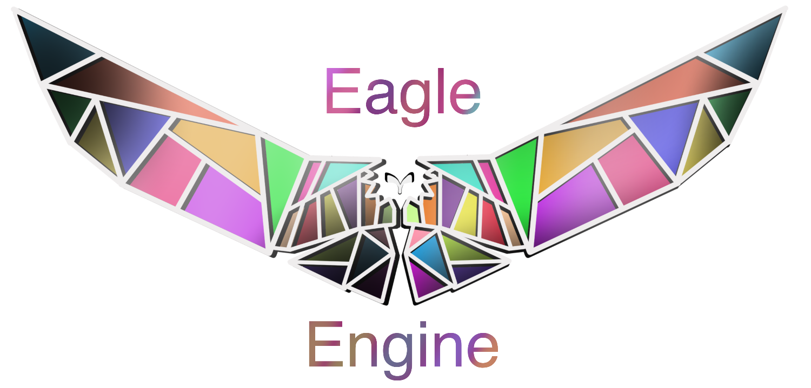

  

# Eagle Engine
Welcome to Eagle Engine - the free and open source game engine that is currently available on Windows.

## Documentation
The official documentation is hosted [here](https://eagledocs.readthedocs.org/en/v0.6/).
The documentation is hosted by [Sphinx](http://www.sphinx-doc.org/en/master/), which is BSD licensed.

## Getting the engine

### Binary downloads

Official binaries of the engine can be found on
[release](https://github.com/IceLuna/Eagle/releases) page.

### Compiling from source

[See the official docs](https://eagledocs.readthedocs.org/en/v0.6/getstarted/installation.html#building-manually)
for compilation instructions.

    

