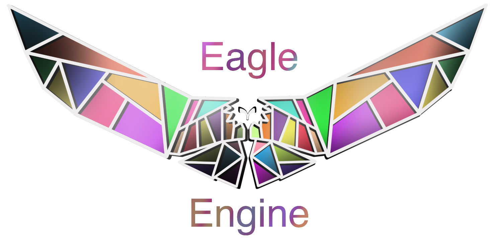

  

# Eagle Engine
Welcome to Eagle Engine - the free and open source game engine that is currently available on Windows.

    

## Main features
- C# scripting with quick hot reloading support
- Physics
- Audio
- Navigation meshes & crowd system
- Modern rendering
  - Physically based rendering
  - Image-based lighting with multiple scattering
  - Order-independent translucency
  - Opaque, translucent, and masked materials
  - Point, spot, and directional lights
  - Soft shadows, and cascades shadow maps
  - Translucent shadows (colored shadow maps)
  - Volumetric lights and fog
  - Ambient occlusion (SSAO, GTAO)
  - Bloom
  - Text rendering (MSDF atlas)
  - Anti-aliasing (TAA)
  - Skeletal animations
  - Node based animation graphs
  - GPU Particle system
  - Depth of Field
  - Motion Blur
  - Screen-space reflections
  - Deferred decals
- Project & asset managers
- Game builds
- Play in editor

## Documentation
The official documentation is hosted [here](https://eagledocs.readthedocs.org/en/v0.7/) by [Sphinx](http://www.sphinx-doc.org/en/master/), which is BSD licensed.

## Getting the engine

### Binary downloads

Official binaries of the engine can be found on
[release](https://github.com/IceLuna/Eagle/releases) page.

### Compiling from source

[See the official docs](https://eagledocs.readthedocs.org/en/v0.7/getstarted/installation.html#building-manually)
for compilation instructions.

### Demo

In progress...
