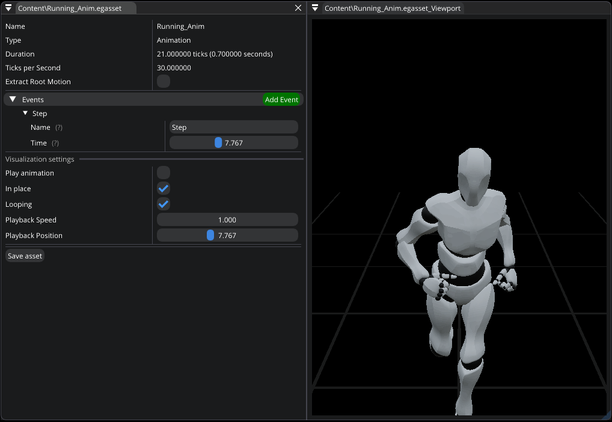

.. _asset_animation:

Animation asset
===============

This asset type represents an animation which you can modify by using `Animation Editor`.

   Animation Editor

|

- **Extract Root Motion**. Some animations have transformation data embedded into them. In this case, you can enable root motion to let animations drive the entity transformation.
  For example, if root motion is supported and enabled, and you're playing "Run" animation, then the whole Entity will move. So, you can build animation-driven gameplay.

- **Events**. You can create animation events that will allow you to react to them in C#.
  For example, if you want to play "Step" sound, you can create an event at an appropriate timing, and when it'll be reached, C# `Entity.OnAnimationEvent()` will be called.
