.. _asset_animation_graph:

Animation Graph asset
=====================

This asset type represents an animation graph which you can modify by using `Animation Graph Editor`.
It allows you to create complex animation logic by usign nodes.

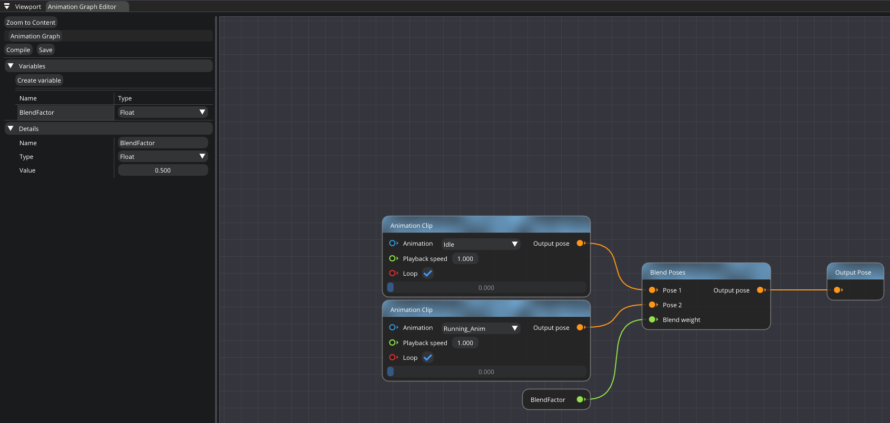

   Animation Graph Editor

|

It allows you to create variables of four types: `Bool`, `Float`, `String`, and `Animation`. All variables can be changed during runtime and accessed in C#.
You can use this asset in `SkeletalMesh` component. Note that each component has its own copy of the graph. So, changing variables in one component won't affect the others.
To break a node link/connection, left-click it while holding `Alt`.

Here's the list of supported nodes:

Select Pose by Bool
-------------------
It selects a pose depending on the condition.

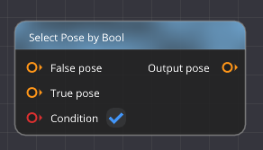
   
|

Animation Clip
--------------
It retrieves an animation from an animation asset.

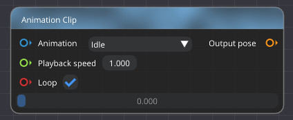
   
|

State Machine
-------------
It allows you to define a transition logic for animations.

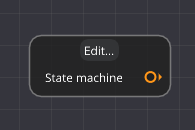
   
|

By clicking on a state itself, you can define an animation that will be played when the state is active.
You can also specify transition settings, such as: transition condition, transition time, smooth transition.

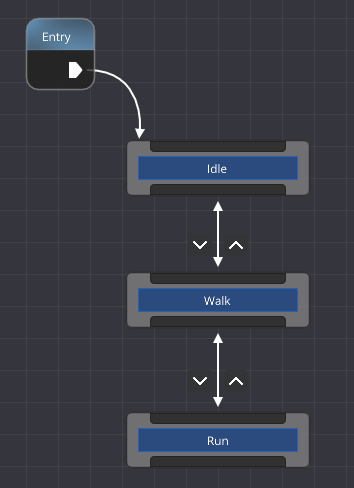

   State Machine example

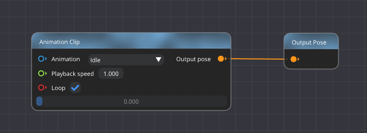

   Idle state

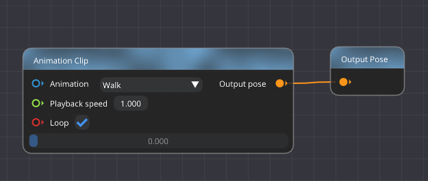

   Walk state

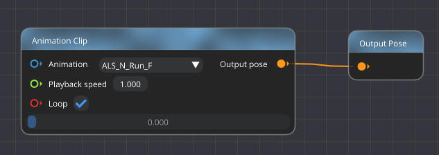

   Run state

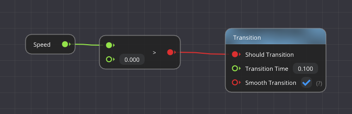

   Idle to Walk transition

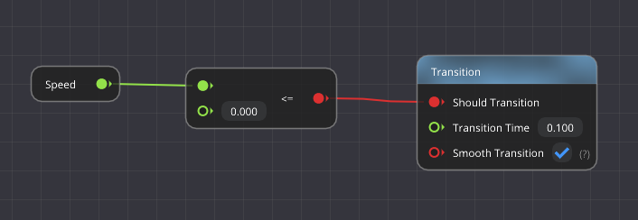

   Walk to Idle transition

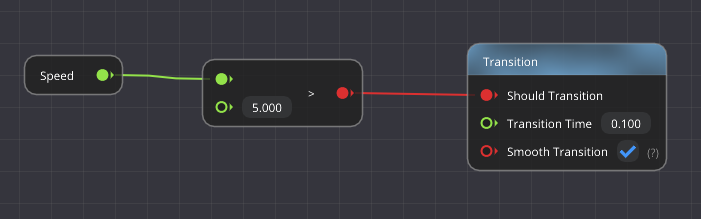

   Walk to Run transition

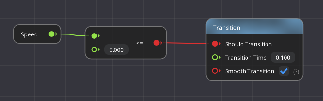

   Run to Walk transition

Blend Poses
-----------
Linearly blends poses based on the weight. `Weight = 0` is `Pose1`, `Weight = 1` is `Pose2`.

   
|

Additive blending
-----------------
**Calculate Additive** and **Additive Blend**. These two can be used to generate new animations based on others.
For example, you have three animations: "Base Idle" pose, "Looking Around" pose, and "Running" pose.
By using `Calculate Additive` node, you can extract data that's unique to "Looking Around" pose. To do so, you need to set "Base Idle" animation as a "Reference" pose, and "Looking Around" as a "Source" Pose.
Now you've successfully extracted the data required for the mesh to look around. Now, by using "Additive Blend" node, you can apply it to other animations.
In this example, let's apply it to "Running" animation. Now, you have a new animation that's running and looking around at the same time.
`Blend Weight` input of `Additive Blend` node controls how strongly "Additive" pose is applied to "Target" pose.

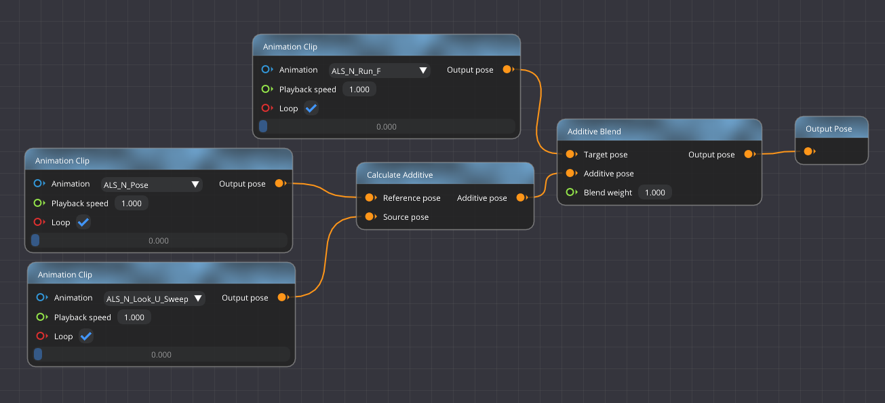

   Running & looking around.

Filter Bones
------------
It allows you to filter out bones. For example, if you want to apply an animation to right hand only, you can do it by specifying its name here.

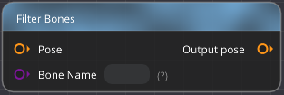
   
|

Math nodes
----------

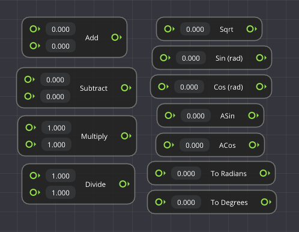
   
|

Logical nodes
-------------

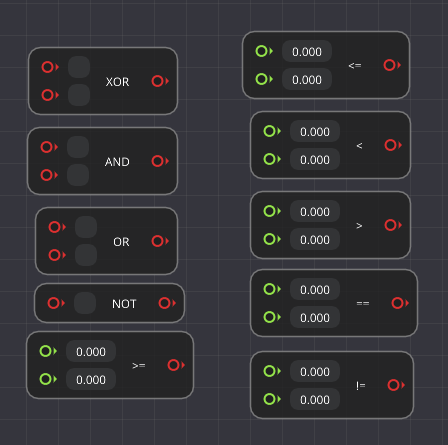
   
|

Comment node
------------
It allows you to group nodes and leave a comment.

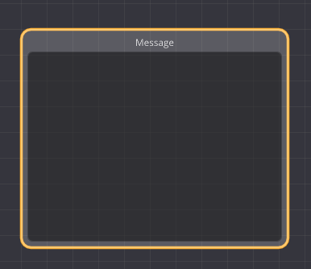
   
|
