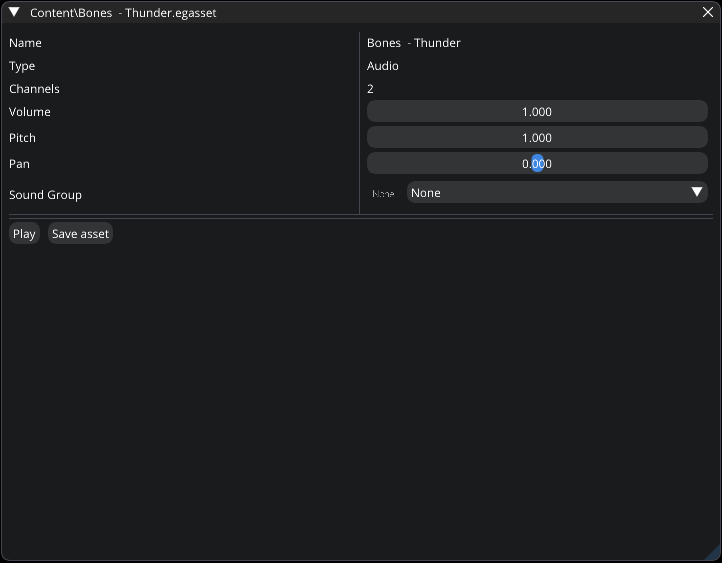

.. _asset_audio:

Audio asset
===========

This asset type represents an audio which you can modify by using `Audio Editor`.

   Audio Editor

|

- **Volume**.

- **Pitch**. Any value between 0 and 10.

- **Pan**. ``-1`` = Completely on the left. ``+1`` = Completely on the right.

- **Sound Group**. Allows you to assign an audio to a :ref:`sound group <asset_sound_group>`
