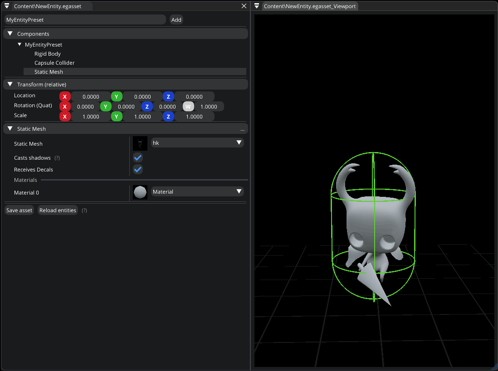

.. _asset_entity:

Entity asset
============

This asset type represents an entity which you can modify by using `Entity Editor`.
It allows you to setup an entity beforehand which can be used to spawn entities at runtime or in the editor.
If you want to spawn it in the editor, just drag & drop it onto the viewport.

.. note::

	To use it in the editor, just drag it from the content browser and drop onto the viewport.

If you make changes to an entity asset, already spawned entities won't be changed automatically.
So, in case you want to recreate spawned entities using the latest asset changes, you can hit the `Reload entities` button.

   Entity Editor

|
