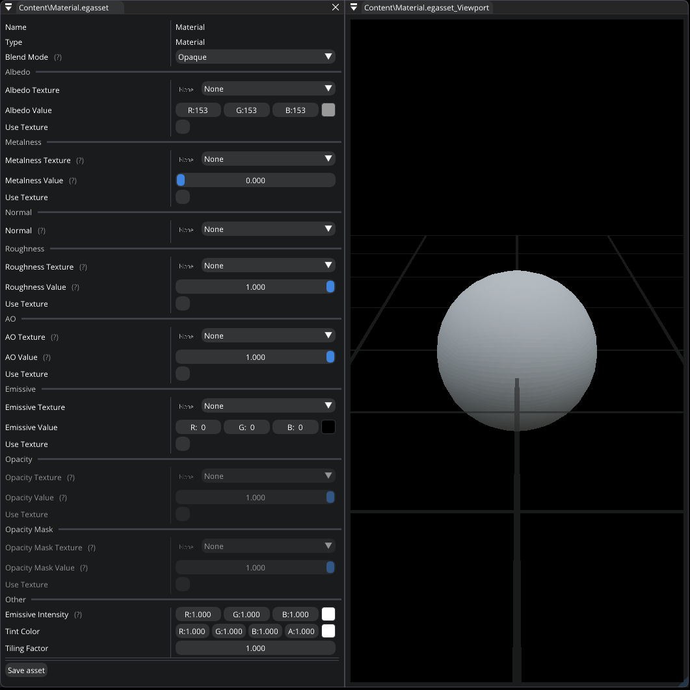

.. _asset_material:

Material asset
==============

This asset type represents a material which you can modify by using `Material Editor`. You can read more about material inputs :ref:`here <materials>`.
Some material inputs can be specified as textures or raw values. If you want to use a texture as an input, set the corresponding checkbox.

   Material Editor

.. note::

	This asset type can be created at runtime using C#

- **Blend Mode**.

- **Albedo**.

- **Metalness**.

- **Normal**.

- **Roughness**.

- **AO**.

- **Emissive**.

- **Opacity**.

- **Opacity Mask**.

- **Emissive Intensity**.

- **Tint Color**.

- **Tiling Factor**.
