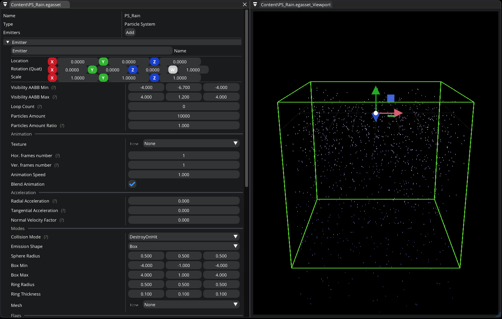

.. _asset_particle_system:

Particle System asset
=====================

This asset type represents a particle system which you can modify by using `Particle System Editor`.

Go :ref:`here <feature_particles>` to learn more about particles and their settings.

   Particle System Editor

.. note::

	This asset type can be created at runtime using C#

