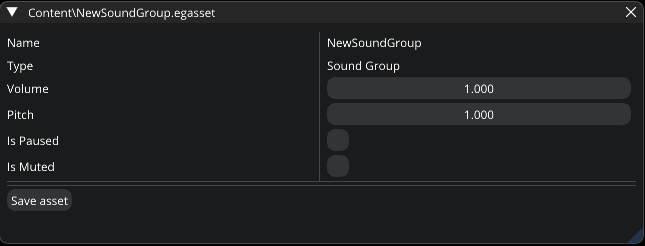

.. _asset_sound_group:

Sound Group asset
=================

This asset type groups :ref:`audio assets <asset_audio>`. For example, you can create a "Background music" sound group and assign audio assets to it. Then, you can mute all of them just by muting the sound group.

   Sound Group Editor

|

- **Volume**.

- **Pitch**.

- **Is Paused**.

- **Is Muted**.
