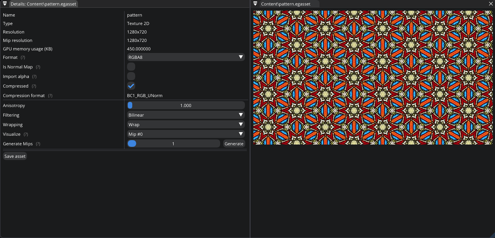
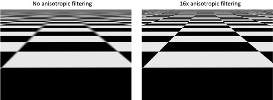
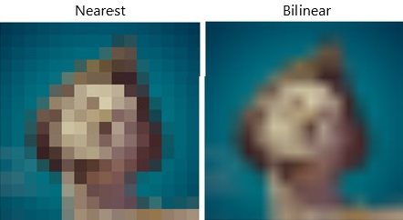
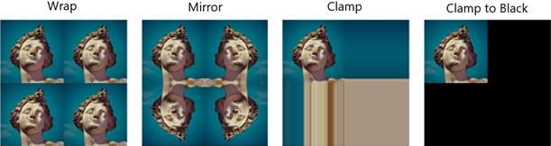
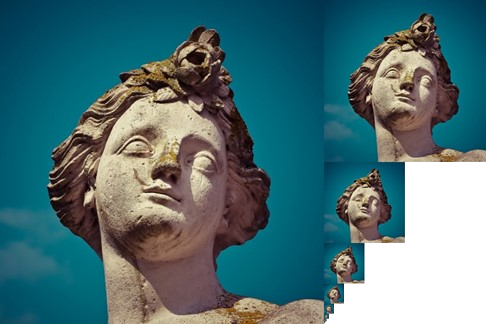

.. _asset_texture_2d:

Texture 2D asset
================

This asset type represents a 2D texture (LDR) which you can modify by using `Texture 2D Editor`.

   Texture 2D Editor

|

- **Format**. Allows you to specify the format of the texture: `R8`, `RG8`, `RGBA8`.

- **Is Normal Map**. If checked, compression method will be changed to better preserve the precision of normals. Currently, it only affects the result if the compression is enabled.

- **Import Alpha**. If checked, compression method will be changed to save alpha channel. Currently, it only affects the result if the compression is enabled.

- **Compressed**.

- **Anisotropic filtering**. Anisotropic filtering improves the appearance of textures viewed at oblique angles. The higher the value, the better it looks. The maximum value is limited by your GPU capabilities.
  Basically, it helps to solve the problem of undersampling where you have more texels than fragments (pixels). Low anisotropic-filtering will lead to artifacts when sampling high frequency patterns like a checkerboard texture at a sharp angle.

   Taken from https://vulkan-tutorial.com/

- **Filtering**. These filters are helpful to deal with problems like oversampling. Currently, you have 3 options: ``Nearest``, ``Bilinear``, ``Trilinear``. 
  What's their purpose? Consider a texture that is mapped to a geometry with more fragments than texels. If you simply took the closest texel for the texture coordinate in each fragment, then you would get a result like on the image on the left.
  If you combined the 4 closest texels through linear interpolation, then you would get a smoother result like the one on the right. Trilinear filtering acts like bilinear, but it also blends between mipmaps.

   Taken from https://vulkan-tutorial.com/

- **Wrapping**. It determines what happens when you try to read texels outside the image. The image below displays some of the possibilities. Available options: ``Wrap``; ``Mirror``; ``Clamp``; ``Clamp to Black``; ``Clamp to White``.

   Taken from https://vulkan-tutorial.com/

- **Mipmaps**. Mipmaps are precalculated and downscaled versions of an image. Each new image is half the width and height of the previous one.
  Mipmaps are used as a form of Level of Detail or LOD. Objects that are far away from the camera will sample their textures from the smaller mip images.
  Using smaller images increases the rendering speed and avoids artifacts such as Moire patterns. `Texture 2D Editor` allows you to generate mips and visualize them. An example of what mipmaps look like:

   Taken from https://vulkan-tutorial.com/
