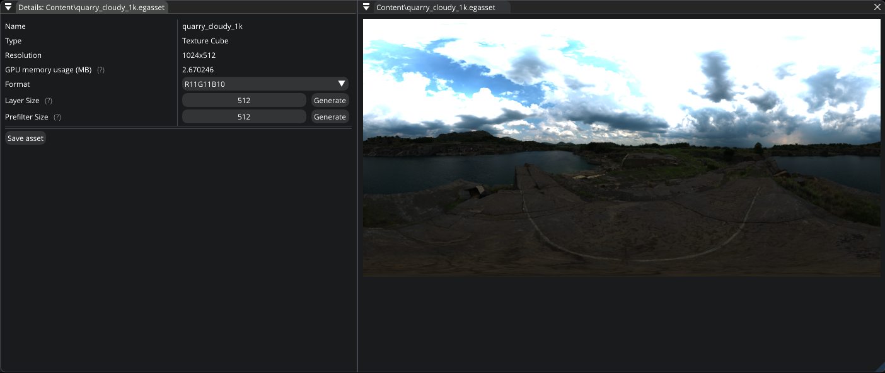

.. _asset_texture_cube:

Texture Cube asset
==================

This asset type represents a cube texture (HDR) which you can modify by using `Texture Cube Editor`.

   Texture Cube Editor

|

- **Format**. Allows you to specify the format of the texture: `RGBA32`, `RGBA16`, `R11G11B10`.

- **Layer Size**. It allows to control the resolution of a cube side.

- **Prefilter Size**. It allows to control the quality of IBL reflection.
