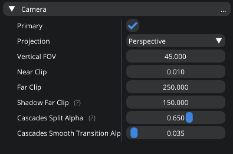
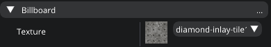

Components
==========
In its core Eagle Engine uses `Entity-Component System` (`ECS <https://en.wikipedia.org/wiki/Entity_component_system>`_) approach.

An entity represents a general-purpose object. For example, every game object is represented as an entity.

A component labels an entity as possessing a particular aspect, and holds the data needed to model that aspect. For example, every game object that can take damage might have a `Health` component associated with its entity.

.. note::

   An entity can only have one component of a given type attached. For example, an entity can't have two ``Static Mesh`` components.

Camera Component
----------------
Represents a camera that can be used for in-game rendering.

Camera Component has the following parameters:

1. `Is Primary`. A scene can have multiple cameras, but which one to use is determined by this flag. If it's set to true, the camera will be enabled.

2. `Projection`. It's either `perspective` or `orthographic`.

3. `FOV`. Field of view.

4. `Near Clip`. Everything closer will be clipped.

5. `Far Clip`. Everything further will be clipped.

6. `Shadow Far Clip`. Beyond this distance shadows will disappear.

7. `Cascades Split Alpha`. It's used to determine how to split shadow cascades for directional light shadows.

8. `Cascades Smooth Transition Alpha`. The blend amount between cascades of directional light shadows. Try to keep it as low as possible.

.. note::

	It doesn't have any input handling. All of that needs to be done manually using C# scripts.

   Camera Component

C# Script Component
-------------------
This components allows you to attach a C# script to an entity.

In the editor, there's a ``Script Class`` drop down menu that contains a list of all your scripts where you can select one.
When a script is selected, the editor displays public values from it allowing you to change their default values without modifying scripts.
Currently, the editor only exposes the following types: ``bool``, ``int``, ``uint``, ``float``, ``string``, ``Vector2``, ``Vector3``, ``Vector4``, ``Color3``, ``Color4``, ``Enum`` (any enum).

   C# Script Component

Sprite Component
----------------
It allows you to render 2D textures that are lit (goes through the PBR pipeline).

Sprite Component has the following parameters:

1. `Does Cast Shadows`.

2. `Is Atlas`. If it's set to true, you can use an atlas for rendering, and the following additional parameters appear:

   a) `Sprite Coords`. It's a sprite index within an atlas (starting from top left corner in 0;0). For example, if an atlas is 128x128 and a sprite has a 32x32 size, and in case you want to select a sprite at 64x32, here you enter 2x1.

   b) `Sprite Size`. Defines a size of a single sprite in the atlas.

   c) `Sprite Size Coef`. In case some sprites have different sizes so this paramater allows you to adjust for that case.

3. Other material inputs such as albedo, normal, etc...

   Sprite Component

   Sprite Component. Atlas

Static Mesh Component
---------------------
It allows you to render meshes.

Static Mesh Component has the following parameters:

1. `Static Mesh`.

2. `Does Cast Shadows`.

3. Other material inputs.

   Static Mesh Component

Billboard Component
-------------------
It represents a texture that always faces the camera. It doesn't account for lighting.

Billboard Component just has a `Texture` parameter.

   Billboard Component

Text Component
--------------
Allows you to render 3D Text.

Text Component has the following parameters:

1. `Font`.

2. `Text`. Use ``Ctrl+Enter`` to drop to a new line.

3. `Does Cast Shadows`.

4. `Is Lit`. If it's set to true, the component will react to lighting and will be lit correspondingly. When checked, additional material input parameters will appear.

5. `Color`. An HDR value that represent a color of the text. If ``Is Lit`` set to true, it's ignored and material inputs are used instead.

6. `Line Spacing`. Spacing between lines.

7. `Kerning`. Spacing between letters.

8. `Max Width`. The maximum width of a line.

   Text Component

Text2D Component
----------------
Allows you to render screen-space 2D Text (useful for in-game UI).

Text2D Component has the following parameters:

1. `Font`.

2. `Text`. Use ``Ctrl+Enter`` to drop to a new line.

3. `Color`. An HDR value that represent a color of the text.

4. `Position`. It's normalized device coords and it is the position of the bottom left vertex of the first symbol. Text2D will try to be at the same position of the screen no matter the resolution and occupy the same amount of space.
   `(-1; -1)` is the bottom left corner of the screen; `(0; 0)` is the center; `(1; 1)` is the top right corner of the screen.

5. `Scale`.

6. `Rotation`.

7. `Opacity`. Controls the translucency of the text.

8. `Is Visible`.

9. `Line Spacing`. Spacing between lines.

10. `Kerning`. Spacing between letters.

11. `Max Width`. Maximum width of a line.

   Text2D Component

Image2D Component
-----------------
Allows you to render textures in screen-space (useful for in-game UI).

Image2D Component has the following parameters:

1. `Texture`.

2. `Tint`. An HDR value that allows you to tint your texture.

3. `Position`. It's normalized device coords and it is the position of the bottom left vertex of the first symbol. Image2D will try to be at the same position of the screen no matter the resolution and occupy the same amount of space.
   `(-1; -1)` is the bottom left corner of the screen; `(0; 0)` is the center; `(1; 1)` is the top right corner of the screen.

4. `Scale`.

5. `Rotation`.

6. `Opacity`. Controls the translucency of the image.

7. `Is Visible`.

.. note::

	`Text2D` is rendered on top of `Image2D`.

   Image2D Component

Audio Component
---------------
It allows you to play 3D sounds.

Audio Component has the following parameters:

1. `Sound`.

2. `Roll off`. It allows you to specify how 3D sounds attenuate as the distance between the listener and the sound increases. You can set one of the following values:

   a) `Linear`. It means that a sounds will follow a linear roll off model where ``MinDistance`` = full volume, ``MaxDistance`` = silence

   b) `Inverse`. It means that a sounds will follow an inverse roll off model where ``MinDistance`` = full volume, ``MaxDistance`` = where sound stops attenuating, and roll-off is fixed according to the global roll off factor.

   c) `LinearSquare`. It means that a sounds will follow a linear-square roll off model where ``MinDistance`` = full volume, ``MaxDistance`` = silence

   d) `InverseTapered`. It means that a sounds will follow the inverse roll off model at distances close to ``MinDistance`` and a linear-square roll off close to ``MaxDistance``

3. `Volume`.

4. `Loop Count`. ``-1`` = ``Loop Endlessly``; ``0`` = ``Play once``; ``1`` = ``Play twice``, etc...

5. `Min Distance`. The minimum distance is the point at which the sound starts attenuating. If the listener is any closer to the source than the minimum distance, the sound will play at full volume.

6. `Max Distance`. The maximum distance is the point at which the sound stops attenuating and its volume remains constant (a volume which is not necessarily zero).

7. `Is Looping`.

8. `Is Streaming`. When you stream a sound, you can only have one instance of it playing at any time. This limitation exists because there is only one decode buffer per stream. As a rule of thumb, streaming is great for music tracks, voice cues, and ambient tracks, while most sound effects should be loaded into memory.

9. `Is Muted`.

10. `Autoplay`. The sound will autoplay when spawned during the simulation.

11. `Enable Doppler Effect`. You can learn more about it `here <https://en.wikipedia.org/wiki/Doppler_effect>`_.

   Audio Component

Reverb Component
----------------
It allows you to play apply effect to 3D sounds.

Reverb Component has the following parameters:

1. `Preset`. It allows you to simulate different types of environments. You can set one of the following values: `Generic`, `Padded Cell`, `Room`, `Bathroom`, `Living Room`, `Stone Room`, `Auditorium`, `Concert Hall`,
   `Cave`, `Arena`, `Hangar`, `Carpetted Hallway`, `Hallway`, `Stone Corridor`, `Alley`, `Forest`, `City`, `Mountains`, `Quarry`, `Plain`, `Parking Lot`, `Sewer Pipe`, `Under Water`.

2. `Min Distance`. Reverb is at full volume within that radius.

3. `Max Distance`. Reverb is disabled outside that radius.

4. `Is Active`.

   Reverb Component

Rigid Body Component
--------------------
It represents a physics object, and each physics object must have it.
It can either be `static` or `dynamic`. `Static` type represents an immovable object meaning it won't react to any forces applied to it.

Rigid Body Component has the following parameters:

1. `Body Type`. It's either `static` or `dynamic`.

2. `Collision Detection`. It's either `Discrete`, `Continuous`, or `Continuous Speculative`. When continuous collision detection (or CCD) is turned on, the affected rigid bodies will not go through other objects at high velocities (a problem also known as `tunnelling <https://gamedev.stackexchange.com/questions/192400/in-games-physics-engines-what-is-tunneling-also-known-as-the-bullet-through>`_).
   A cheaper but less robust approach is called speculative CCD.

3. `Mass`. If the mass is set to 0, the body will have infinite mass so its linear velocity cannot be changed by any constraints.

4. `Linear Damping`.

5. `Angular Damping`.

6. `Max Linear Velocity`.

7. `Max Angular Velocity`.

8. `Is Gravity Enabled`.

9. `Is Kinematic`. Sometimes controlling an actor using forces or constraints is not sufficiently robust, precise or flexible. For example, moving platforms or character controllers often need to manipulate an actor's position or make it exactly follow a specific path.
   Such a control scheme is provided by kinematic actors. A kinematic actor is controlled using the ``SetKinematicTarget`` function. Each simulation step PhysX moves the actor to its target position, regardless of external forces, gravity, collision, etc.
   Thus, one must continually call ``SetKinematicTarget``, every time step, for each kinematic actor, to make them move along their desired paths. The movement of a kinematic actor affects dynamic actors with which it collides or to which it is constrained with a joint.
   The actor will appear to have infinite mass and will push regular dynamic actors out of the way.

10. `Lock Position`. Can be used to prevent physics system from changing position.

11. `Lock Rotation`. Can be used to prevent physics system from changing rotation.

   Rigid Body Component

Box Collider Component
----------------------
It represents a physics collider that has the shape of a box.

Box Collider Component has the following parameters:

1. `Static Friction`. Static friction defines the amount of friction that is applied between surfaces that are not moving lateral to each-other.

2. `Dynamic Friction`. Dynamic friction defines the amount of friction applied between surfaces that are moving relative to each-other.

3. `Bounciness`.

4. `Is Trigger`. Its role is to report that there has been an overlap with another shape. Trigger shapes play no part in the simulation of the scene.

5. `Size`. XYZ-size of the box colider.

6. `Is Collision Visible`. Can be used to visualize collision bounds.

   Box Collider Component

Sphere Collider Component
-------------------------
It represents a physics collider that has the shape of a sphere.

Sphere Collider Component has the following parameters:

1. `Static Friction`. Static friction defines the amount of friction that is applied between surfaces that are not moving lateral to each-other.

2. `Dynamic Friction`. Dynamic friction defines the amount of friction applied between surfaces that are moving relative to each-other.

3. `Bounciness`.

4. `Is Trigger`. Its role is to report that there has been an overlap with another shape. Trigger shapes play no part in the simulation of the scene.

5. `Radius`. Radius of the sphere collider.

6. `Is Collision Visible`. Can be used to visualize collision bounds.

   Sphere Collider Component

Capsule Collider Component
--------------------------
It represents a physics collider that has the shape of a capsule.

Capsule Collider Component has the following parameters:

1. `Static Friction`. Static friction defines the amount of friction that is applied between surfaces that are not moving lateral to each-other.

2. `Dynamic Friction`. Dynamic friction defines the amount of friction applied between surfaces that are moving relative to each-other.

3. `Bounciness`.

4. `Is Trigger`. Its role is to report that there has been an overlap with another shape. Trigger shapes play no part in the simulation of the scene.

5. `Radius`. Radius of the capsule collider.

6. `Height`. Height of the capsule collider.

7. `Is Collision Visible`. Can be used to visualize collision bounds.

   Capsule Collider Component

Mesh Collider Component
-----------------------
It represents a physics collider that has the shape of a mesh.

Mesh Collider Component has the following parameters:

1. `Mesh`. A mesh to create a collider from.

2. `Static Friction`. Static friction defines the amount of friction that is applied between surfaces that are not moving lateral to each-other.

3. `Dynamic Friction`. Dynamic friction defines the amount of friction applied between surfaces that are moving relative to each-other.

4. `Bounciness`.

5. `Is Trigger`. Its role is to report that there has been an overlap with another shape. Trigger shapes play no part in the simulation of the scene.

6. `Is Collision Visible`. Can be used to visualize collision bounds.

7. `Is Convex`. When set to true, collider will be created using a rough approximation of the mesh. Non-convex mesh collider can be used only with kinematic or static actors.

8. `Is two-sided`. Only affects non-convex mesh colliders. Non-convex meshes are one-sided meaning collision won't be registered from the back side. For example, that might be a problem for windows.
   So to fix this problem, you can set this flag to true

   Mesh Collider Component

Point Light Component
---------------------
It allows you to use `point` light sources.

Point Light Component has the following parameters:

1. `Light Color`.

2. `Intensity`.

3. `Attenuation Radius`. Can be used to limit light's influence. Make it as small as possible for better performance.

4. `Does affect world`. Can be used to completely disable a light.

5. `Does cast shadows`. Whenever you don't really need it, disable it to save on performance and GPU memory.

6. `Visualize Radius`.

7. `Is Volumetric`. When set to true, it's performance intensive. For it to account for object interaction, light needs to cast shadows. If you want to use it, enable `Volumetric Light` feature in Renderer Settings.

8. `Volumetric Fog Intensity`.

   Point Light Component

Spot Light Component
--------------------
It allows you to use `spot` light sources.

Spot Light Component has the following parameters:

1. `Light Color`.

2. `Intensity`.

3. `Attenuation Distance`.  Can be used to limit light's influence. Make it as small as possible for better performance.

4. `Inner Angle`.

5. `Outer Angle`.

6. `Does affect world`. Can be used to completely disable a light.

7. `Does cast shadows`. Whenever you don't really need it, disable it to save on performance and GPU memory.

8. `Visualize Distance`.

9. `Is Volumetric`. When set to true, it's performance intensive. For it to account for object interaction, light needs to cast shadows. If you want to use it, enable `Volumetric Light` feature in Renderer Settings.

10. `Volumetric Fog Intensity`.

   Spot Light Component

Directional Light Component
---------------------------
It allows you to use `directional` light sources.

Directional Light Component has the following parameters:

1. `Light Color`.

2. `Intensity`.

3. `Ambient`. It can be used to light parts of the scene that aren't directly seen by it.

4. `Does affect world`. Can be used to completely disable a light.

5. `Does cast shadows`. Whenever you don't really need it, disable it to save on performance and GPU memory.

6. `Visualize Direction`.

7. `Is Volumetric`. When set to true, it's performance intensive. For it to account for object interaction, light needs to cast shadows. If you want to use it, enable `Volumetric Light` feature in Renderer Settings.

8. `Volumetric Fog Intensity`.

   Directional Light Component
