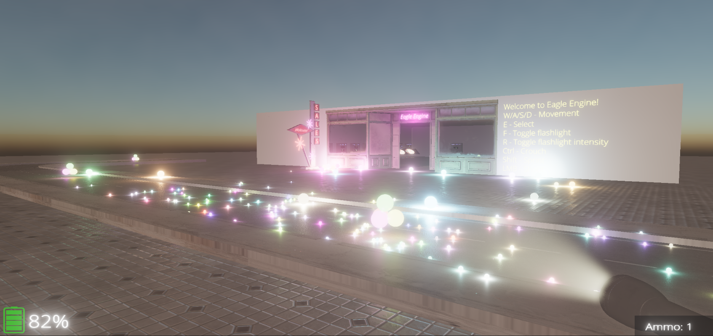

Demo
====
By default, the engine comes with a project where you can run around, jump, shoot, change renderer settings, and even teleport to a different scene.

You can use it as a starting point to learn about using the engine.

.. note::
    IBL is disabled by default to reduce gpu memory usage. That's why in-game `IBL` switch won't work.
    Enabling IBL will fix it. (`Eagle/Sandbox/Content/Textures/IBL/limpopo_golf_course_4k.hdr`)

.. figure:: imgs/demo_scene.png
    :align: center 

    Demo project

    Demo runtime
