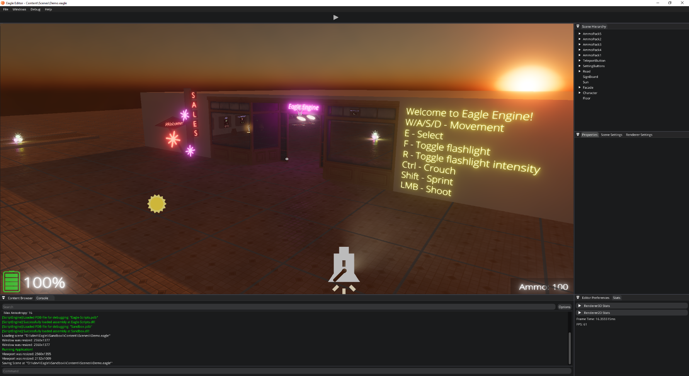

Demo
====
By default, the engine comes with a project where you can run around, jump, shoot, and change renderer settings, and even teleport to a different scene.

You can use it as a starting point to learn about using the engine.

    Demo project
