Editor
======

If you've successfully :ref:`installed <installation_guide>` `Eagle Engine`, created a :ref:`project <projects>` and now you want to learn more on how to use it, you're at the right place (hopefully).

`Eagle Editor` is a tool that allows you to easily use the engine's core functionality and build beautiful worlds.

When you open a project, you should see something like this.

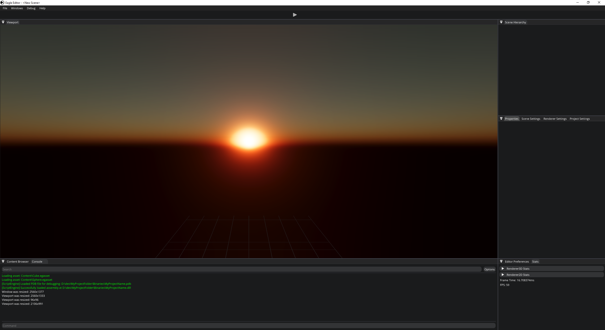

   Eagle Editor

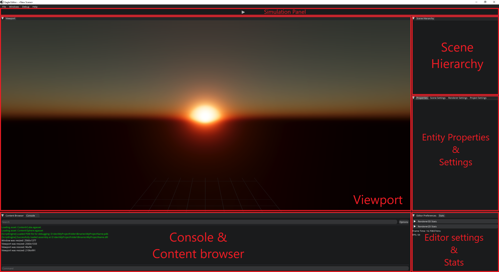

   Main UI panels

.. _viewport:

|

Viewport
--------
It's a panel that displays the result of rendering. The editor provides a camera for you so you can move around the scene.
To move around, press and hold `Right mouse button` (RMB) somewhere within the viewport and use `W`/`A`/`S`/`D` and `Q`/`E` buttons to move. You can also use your mouse-wheel to adjust the speed of the editor camera.

Through the viewport, you can select objects by left-clicking them. The editor will display gizmo controls at the origin so you can change its transform.
`Gizmo` has 4 states: `Hidden`, `Translation`, `Rotation`, `Scale`. You can switch between states using `Q`, `W`, `E`, `R` buttons respectively.
It also supports snapping. To enable snapping, hold `Left Shift` while changing object's transform.

.. note::
	
	Snapping values can be changed in `Editor Preferences`_ panel

Menu Bar
--------
Menu bar contains some important items

- `File`. It allows you to perform project related actions, open a new empty scene; save the scene or even close the engine. If you ever dare to choose ``Save as...``, please save it within project's `Content` folder.

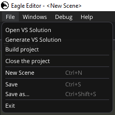

|

- `Windows`. Use it to open/close some additional windows

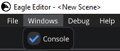

|

- `Debug`. Allows you to see CPU (per thread) and GPU timings; GPU memory usage; and visualize some rendering related data. ``CPU Timings`` and ``GPU Timings`` windows allow you to see what your CPU and GPU are doing. They show you the list of tasks that were just executed and how much time it took to execute. Since the engine uses two threads (main and render), ``CPU Timings`` tab displays timings per thread. Each of these windows allow you to pause the updates of the timings. ``GPU Memory Usage`` shows you what resources take up the GPU memory.

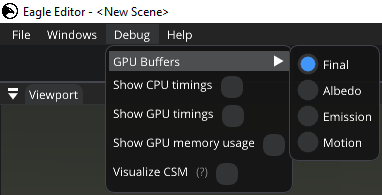

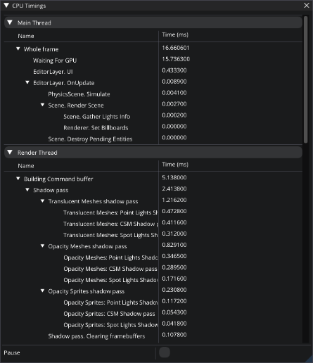

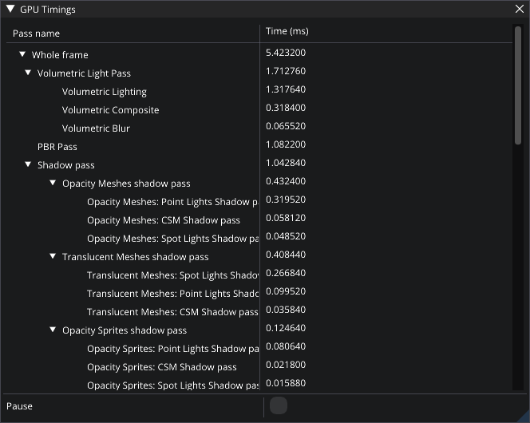

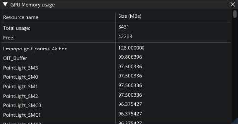

|

Simulation Panel
----------------
It allows you to play your game right in the editor. If the camera isn't provided by you, you'll be able to use editor's camera during simulation.

Scene Hierarchy
---------------
`Scene Hierarchy` is a hierarchy of all entities in the scene. It allows you to:

- Select an entity to change its parameters (more on that :ref:`later <entity_properties>`).
- Create and delete entities by pressing `RMB`. Also, you can press `DEL` to delete the selected entity. In case you right-clicked on an entity in the hierarchy and pressed ``Create Entity``, newly created entity will become its child.
- Drag and drop entities onto each other to build dependencies (child-entities react to transformation changes of a parent and move accordingly). If you want to detach an entity, right click it and select ``Detach from parent``.
  Or you can drag and drop it onto ``Scene Hierarchy`` window name.

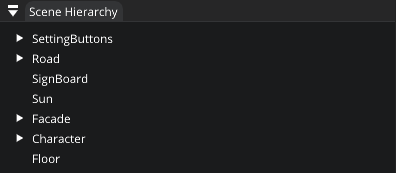

.. _entity_properties:

|

Entity Properties
-----------------
`Properties` panel allows you to modify an entity in any imaginable way (almost). By default, it's located right under `Scene Hierarchy`.

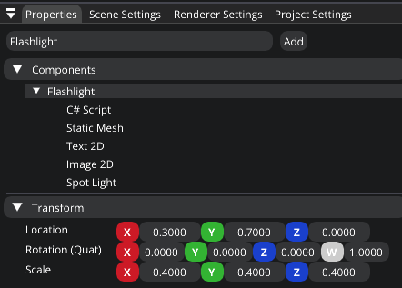

On the image above, you can see that the entity named ``Flashlight`` is selected. The panel displays its name, list of components, and transformation.
It also allows you to add new components by clicking on `Add` button which will display all the components you can add.

If you selected a component, the panel will display its relative transformation and all other settings that you can change.
On the right side of the tree node, you'll see three dots. Currently, by clicking on it, you can remove a component.
Alternatively, you can just remove a component by right-clicking it in the list of components and pressing `Remove Component`.

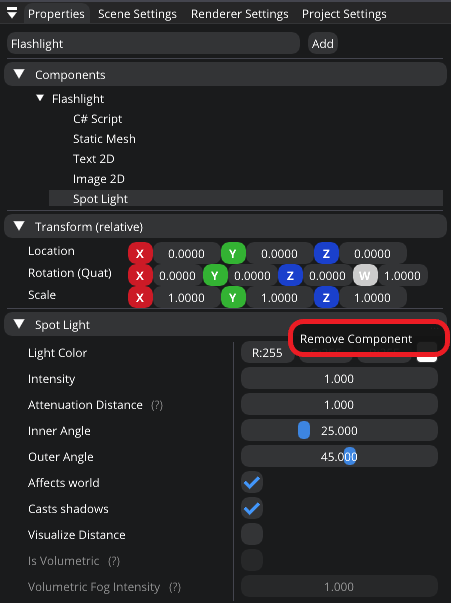

.. note::

   You can reset transformations by clicking on `X`/`Y`/`Z`/`W` buttons. Or you can modify it manually by double clicking the input fields.

.. note::

	You can modify drag-controls manually by clicking it while holding the `Ctrl` key.

.. _scene_settings:

Scene Settings
--------------
It allows you to change some scene related parameters, such as `Gravity` and `Skybox`.

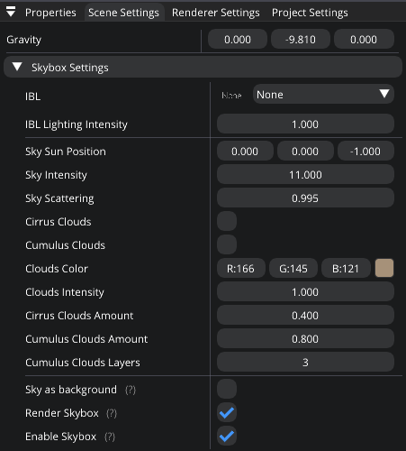

|

.. _renderer_settings:

Renderer Settings
-----------------
As you've probably guessed, it allows you to change renderer settings. And they're saved when engine is closed.

.. note::
	
	Changing them affects the whole project, not just an opened scene.

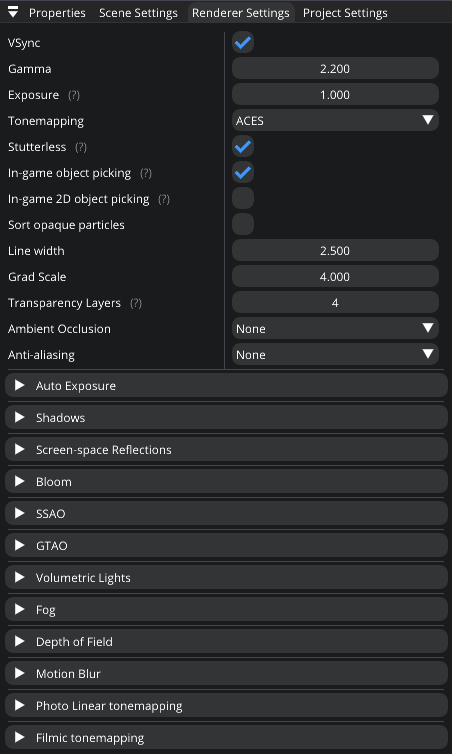

|

.. _project_settings:

Project Settings
-----------------
It allows you to change game startup scene and project version.

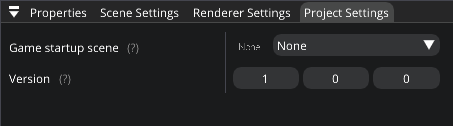

|

.. _Editor Preferences:

Editor Preferences
------------------
Allows you to change the editor preferences, such as `snapping` values and `style`.
As was described in the `viewport`_ section, `snapping` values affect the way you can move objects around.

Also, you can change the following settings:

- **Eco Rendering**. If checked, the scene won't be rendered if the editor is not in focus.
- **Update Animations**. If checked, animations will be updated in the editor mode.
- **Draw Editor Miscellaneous**.
- **Draw Nav Mesh**.
- **Stop simulation key**. The editor will stop the game-simulation when this key is pressed. Set it to 'None' to disable.

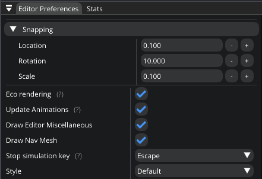

|

Stats
-----
It displays some renderer statistics.

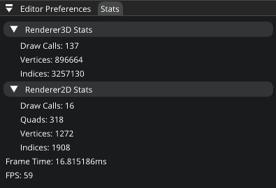

|

Content Browser
---------------
`Content Browser` lets you to navigate through asset files and open some of them. For example, you can open textures and change its settings.

.. note::
	It navigates through `Content` folder of the project.

`Content Browser` features:

- **Searching**. It allows you to search for files within a project.
- **Navigation**. To navigate, double-click the icon or single-click file's/folder's name. If the name of a file doesn't fit inside a button, you can hover it to see its full name.
- **Navigation History**. Underneath the search panel you can see the navigation history. You can navigate back by pressing history buttons or clicking back/forward buttons. Also you can use additional mouse buttons to navigate back/forward.
- **Right-click popup**. You can right-click anything in content browser and press `Show in Explorer`. Or you can right-click any file (not directory) and press ``Show in Folder View`` to show it in `Content Browser`. It's useful if you found a file using search and now you want to navigate to its location within the `Content Browser`.
- **Drag & Drop**. You can drag and drop assets from Content Browser to folders and to the corresponding UI-input fields.
- **Import and Create assets**.
- **Open Assets**. You can open assets to change theirs settings.
- **Assets manupulations**. You can copy, cut, paste, duplicate, save, and delete assets. When you delete an asset, it might still be used by some other assets/components. So, it won't be completely removed until the project/engine is restarted.
- **Cyrillic**. Content browser supports cyrillic.
- **Creation of folder**. Right-click on an empty space and press ``Create folder``.
- **Runtime Thumbnails**.

.. note::
	Content Browser is not updated if it's not hovered to save CPU cycles.

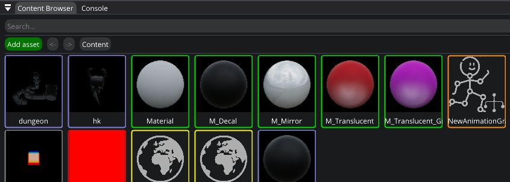

|

Console
-------
It allows you to see all engine messages and errors.
Currently, it supports a couple of commands: ``Help`` and ``Clear``. ``Help`` command displays all supported commands and ``Clear`` command clears the console.
Console also supports searches to filter the messages you need.

.. note::

	You can use up/down arrow buttons to go through the history of commands.
	Console also supports command auto-completion by pressing Tab.

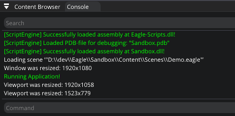

|

Assets
------
Currently, the engine supports the following asset types:

- :ref:`Texture 2D <asset_texture_2d>`. Supported formats: ``png``; ``jpg``; ``tga``.

- :ref:`Texture Cube <asset_texture_cube>`. Supported format: ``hdr``.

- :ref:`Static <asset_static_mesh>` & :ref:`**Skeletal** <asset_skeletal_mesh>` meshes. Supported mesh formats: ``fbx``; ``gltf``, ``blend``; ``3ds``; ``obj``; ``smd``; ``vta``; ``stl``.

- :ref:`Audio <asset_audio>`. Supported sound formats: ``mp3``; ``wav``; ``ogg``; ``wma``.

- :ref:`Sound Group <asset_sound_group>`.

- :ref:`Font <asset_font>`. Supported font formats: ``ttf``; ``otf``.

- :ref:`Material <asset_material>`.

- :ref:`Physics Material <asset_physics_material>`.

- :ref:`Entity <asset_entity>`.

- :ref:`Scene <asset_scene>`.

- :ref:`Animation <asset_animation>`.

- :ref:`**Animation Graph <asset_animation_graph>`.

- :ref:`Particle System <asset_particle_system>`.

You can use Content Browser to create/import assets by clicking `Add asset` button. Also, all assets can be opened by double-clicking them.

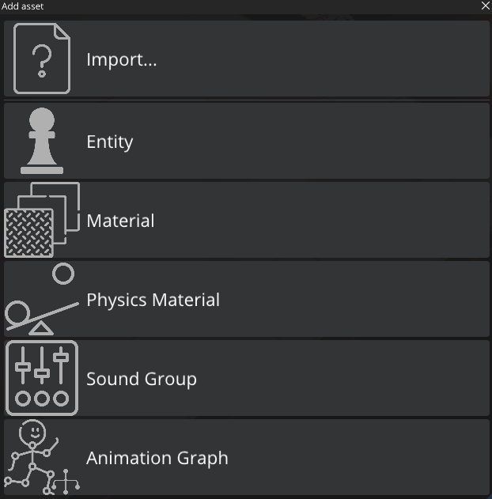

   Add asset UI

.. note::

	Modifying assets during simulation runtime (from C#) won't be reverted when it stops.
	You can create some asset types during runtime that will be destroyed when it stops.
	Such assets types: `Material`, `Physics Material`, and `Particle System`.

Use the links below to learn more about assets & their settings

.. toctree::
   :maxdepth: 1

   assets/texture2d
   assets/texturecube
   assets/staticmesh
   assets/skeletalmesh
   assets/sound_group
   assets/audio
   assets/font
   assets/material
   assets/physics_material
   assets/entity
   assets/scene
   assets/animation
   assets/animation_graph
   assets/particle_system

Shortcuts
---------
- **F2**. Renames a selected asset, graph variable, or sub-graph.
- **F5**. Reloads the shaders if there were any changes.
- **Ctrl+N**. Opens a new empty scene.
- **Ctrl+S**. Saves the current scene.
- **Ctrl+Shift+S**. Opens up a dialogue to choose where to save the scene.
- **G**. Toggles the visibility of editor specific rendered elements (such as grid).
- **Alt+P**. Toggles the simulation button.
- **F11**. Toggles viewport fullscreen mode.
- **Shift+F11**. Toggles window fullscreen mode.
- **Q**/**W**/**E**/**R**. **Hidden**/**Location**/**Rotation**/**Scale** gizmo modes.
- **Delete**. Deletes selected entity or asset.
- **Ctrl+D**. Duplicates selected entity.
- **Ctrl+W**. Duplicates selected asset.
- **Ctrl+X/C/V**. Cuts/Copies/Pastes an asset.
