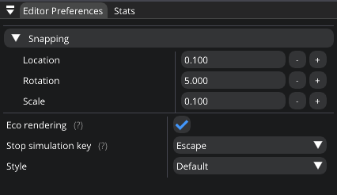

Editor
======

If you've successfully :ref:`installed <installation_guide>` `Eagle Engine` and now you want to learn more on how to use it, you're at the right place (hopefully).

`Eagle Editor` is a tool that allows you to easily use the engine's core functionality and build beautiful worlds.

When you run `Eagle Editor`, you should see something like this.

.. figure:: imgs/demo_scene.png
   :align: center

   Eagle Editor

   Main UI panels

.. _viewport:

|

Viewport
--------
It's a panel that displays the result of rendering. The editor provides a camera for you so you can move around the scene.
To move around, press and hold `Right mouse button` (RMB) somewhere within the viewport and use `W`/`A`/`S`/`D` and `Q`/`E` buttons to move. You can also use your mouse-wheel to adjust the speed of the editor camera.

Through the viewport, you can select objects by left-clicking them. The editor will display gizmo controls at the origin so you can change its transform.
`Gizmo` has 4 states: `Hidden`, `Translation`, `Rotation`, `Scale`. You can switch between states using `Q`, `W`, `E`, `R` buttons respectively.
It also supports snapping. To enable snapping, hold `Left Shift` while changing object's transform.

.. note::
	
	Snapping values can be changed in `Editor Preferences`_ panel

Menu Bar
--------
Menu bar contains some important items

- `File`. It allows you to open a new empty scene; save the scene or even close the engine. If you choose ``Save as...``, please save it within project's `Content` folder.

|

- `Windows`. Use it to open/close some additional windows

|

- `Debug`. Allows you to see CPU (per thread) and GPU timings; GPU memory usage; and visualize some rendering related data. ``CPU Timings`` and ``GPU Timings`` windows allow you to see what your CPU and GPU are doing. They show you the list of tasks that were just executed and how much time it took to execute. Since the engine uses two threads (main and render), ``CPU Timings`` tab displays timings per thread. Each of these windows allow you to pause the updates of the timings. ``GPU Memory Usage`` shows you what resources take up the GPU memory.

.. image:: imgs/menubar_debug.png
   :align: center

.. image:: imgs/gpu_timings.png
   :align: center

.. image:: imgs/gpu_mem_usage.png
   :align: center

|

Simulation Panel
----------------
It allows you to play your game right in the editor. If the camera isn't provided by you, you'll be able to use editor's camera during simulation.

Scene Hierarchy
---------------
`Scene Hierarchy` is a hierarchy of all entities in the scene. It allows you to:

- Select an entity to change its parameters (more on that `later`_).
- Create and delete entities by pressing `RMB`. Also, you can press `DEL` to delete the selected entity. In case you right-clicked on an entity in the hierarchy and pressed ``Create Entity``, newly created entity will become its child.
- Drag and drop entities onto each other to build dependencies (child-entities react to transformation changes of a parent and move accordingly). If you want to detach an entity, right click it and select ``Detach from parent``.
  Or you can drag and drop it onto ``Scene Hierarchy`` window name.

.. _later:

|

Entity Properties
-----------------
`Properties` panel allows you to modify an entity in any imaginable way (almost). By default, it's located right under `Scene Hierarchy`.

On the image above, you can see that the entity named ``Flashlight`` is selected. The panel displays its name, list of components, and transformation.
It also allows you to add new components by clicking on `Add` button which will display all the components you can add.

If you selected a component, the panel will display its relative transformation and all other settings that you can change.
On the right side of the tree node, you'll see three dots. Currently, by clicking on it, you can remove a component.
Alternatively, you can just remove a component by right-clicking it in the list of components and pressing `Remove Component`.

.. note::

   You can reset transformations by clicking on `X`/`Y`/`Z` buttons. Or you can modify it manually by double clicking the input fields.

.. note::

	You can modify drag-controls manually by clicking it while holding the `Ctrl` key.

.. _scene_settings:

Scene Settings
--------------
It allows you to change some scene related parameters.
Currently, it's skybox settings such as IBL (Image-based lighting) and Sky.

|

.. _renderer_settings:

Renderer Settings
-----------------
As you've probably guessed, it allows you to change renderer settings. And they're saved when engine is closed.

.. note::
	
	Changing them affects the whole project, not just an opened scene.

|

.. _Editor Preferences:

Editor Preferences
------------------
Allows you to change the editor preferences, such as `snapping` values and `style`.
As was described in the `viewport`_ section, `snapping` values affect the way you can move objects around.

Also, you can specify an additional key that will terminate the game-simulation.

|

Stats
-----
It displays some renderer statistics.

|

Content Browser
---------------
`Content Browser` lets you to navigate through asset files and open some of them. For example, you can open textures and change its settings.

.. note::
	It navigates through `Content` folder of the project.

`Content Browser` features:

- **Searching**. It allows you to search for files within a project.
- **Navigation**. To navigate, double-click the icon or single-click file's/folder's name. If the name of a file doesn't fit inside a button, you can hover it to see its full name.
- **Navigation History**. Underneath the search panel you can see the navigation history. You can navigate back by pressing history buttons or clicking back/forward buttons. Also you can use additional mouse buttons to navigate back/forward.
- **Right-click popup**. You can right-click anything in content browser and press `Show in Explorer`. Or you can right-click any file (not directory) and press ``Show in Folder View`` to show it in `Content Browser`. It's useful if you found a file using search and now you want to navigate to its location within the `Content Browser`.
- `Content Browser` allows you to open scenes.
- **Drag & Drop**. You can drag and drop Texture/Mesh/Audio files from Content Browser to the corresponding UI-input fields.
- **Open Textures** (Texture Viewer). `Texture Viewer` shows texture details and allows you to change its settings. Read more about `texture viewer`_.
- **Cyrillic**. Content browser supports cyrillic.
- **Creation of folder**. Right-click on an empty space and press ``Create folder``.

.. note::
	Content Browser is not updating if it's not hovered to save CPU cycles.

|

Console
-------
It allows you to see all engine messages and errors.
Currently, it supports a couple of commands: ``Help`` and ``Clear``. ``Help`` command displays all supported commands and ``Clear`` command clears the console.
Console also supports searches to filter the messages you need.

.. note::

	You can use up/down arrow buttons to go through the history of commands.
	Console also supports command auto-completion by pressing Tab.

.. image:: imgs/console.png
   :align: center

|

.. _texture viewer:

Texture Viewer
--------------
It's a useful tool that can help you to configure textures.

.. image:: imgs/texture_viewer.png
   :align: center 

|

- **Anisotropic filtering**. Anisotropic filtering improves the appearance of textures viewed at oblique angles. The higher the value, the better it looks. The maximum value is limited by your GPU capabilities.
  Basically, it helps to solve the problem of undersampling where you have more texels than fragments (pixels). Low anisotropic-filtering will lead to artifacts when sampling high frequency patterns like a checkerboard texture at a sharp angle.

   Taken from https://vulkan-tutorial.com/

- **Filtering**. These filters are helpful to deal with problems like oversampling. Currently, you have 3 options: ``Nearest``, ``Bilinear``, ``Trilinear``. 
  What's their purpose? Consider a texture that is mapped to a geometry with more fragments than texels. If you simply took the closest texel for the texture coordinate in each fragment, then you would get a result like on the image on the left.
  If you combined the 4 closest texels through linear interpolation, then you would get a smoother result like the one on the right. Trilinear filtering acts like bilinear, but it also blends between mipmaps.

   Taken from https://vulkan-tutorial.com/

- **Wrapping**. It determines what happens when you try to read texels outside the image. The image below displays some of the possibilities. Available options: ``Wrap``; ``Mirror``; ``Clamp``; ``Clamp to Black``; ``Clamp to White``.

   Taken from https://vulkan-tutorial.com/

- **Mipmaps**. Mipmaps are precalculated and downscaled versions of an image. Each new image is half the width and height of the previous one.
  Mipmaps are used as a form of Level of Detail or LOD. Objects that are far away from the camera will sample their textures from the smaller mip images.
  Using smaller images increases the rendering speed and avoids artifacts such as Moire patterns. `Texture Viewer` allows you to generate mips and visualize them. An example of what mipmaps look like:

   Taken from https://vulkan-tutorial.com/

Assets
------
Currently, the engine supports 6 types of assets that are listed below.

- **Textures**. Supported texture formats: ``png``; ``jpg``; ``tga``.

- **Cube Texture**. Supported cube texture formats: ``hdr``.

- **Meshes**. Supported mesh formats: ``fbx``; ``blend``; ``3ds``; ``obj``; ``smd``; ``vta``; ``stl``.

- **Sounds**. Supported sound formats: ``wav``; ``ogg``; ``wma``.

- **Fonts**. Supported font formats: ``ttf``; ``otf``.

- **Scenes**. It's `Eagle Engine` specific file-format that has an ``.eagle`` extension.

.. note::

	The editor displays a drop-down menu of all imported assets of a specific type.
	An asset is imported if it was used somewhere at least once. If you don't see your asset in the list, it means it's not imported. In that case, just drag it from the `Content Browser` and drop it on a UI input-field.

.. note::

   Some mesh files may contain multiple meshes. In that case, when importing it, you'll receive a message that will ask you if you want to combine all the meshes into a single mesh, or import them as separate meshes.

.. note::

   Please, place all your assets somewhere within `Content` folder of the project so that the engine is aware of them.

Shortcuts
---------
- **F5**. Reloads the shaders if there were any changes.
- **Ctrl+N**. Opens a new empty scene.
- **Ctrl+S**. Saves the current scene.
- **Ctrl+Shift+S**. Opens up a dialogue to choose where to save the scene.
- **G**. Toggles the visibility of editor specific rendered elements (such as grid).
- **Alt+P**. Toggles the simulation button.
- **F11**. Toggles viewport fullscreen mode.
- **Shift+F11**. Toggles window fullscreen mode.
- **Q**/**W**/**E**/**R**. **Hidden**/**Location**/**Rotation**/**Scale** gizmo modes.
