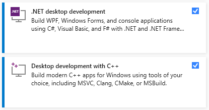
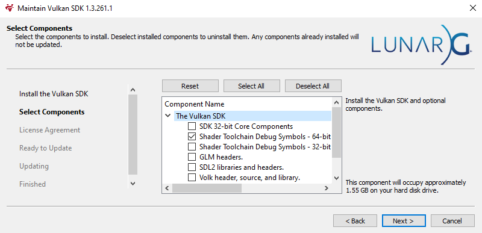

.. _installation_guide:

Installation
============

If you just want to download the engine and use it without doing anything fancy to it, just `download`_ it. Or you can build it `manually`_.

.. _manually:

Building Manually
-----------------
Steps to build the engine:

- Install `VulkanSDK 1.3.261.1 <https://sdk.lunarg.com/sdk/download/1.3.261.1/windows/VulkanSDK-1.3.261.1-Installer.exe>`_. (current version of the engine was tested on it)
- Install ``Visual Studio`` with `C++` and `.NET SDK` support. `.NET` support is required for building scripts core.
- Install ``Git``
- Clone the `repository <https://github.com/iceluna/eagle>`_ using the following command: ``git clone --recursive https://github.com/IceLuna/Eagle``
- In the root directory, open ``scripts`` folder and run one of the scripts to generate VS solution.
- Go to the root directory, run ``Eagle.sln``, build the solution and run `Eagle-Editor`.

   Visual Studio requirements

   Vulkan SDK + Debug symbols

.. note::
	
	It is recommended to restart your PC after installing `Vulkan SDK`. If you didn't restart PC and face any issues, try restarting it and regenerating VS solution.
	
The solution has three configurations: `Debug`; `Release`; `Dist`.
In `Debug` configuration, all optimizations are disabled, and some Eagle Engine debug tools are enabled. For example, you can use `PhysX Visual Debugger <https://developer.nvidia.com/physx-visual-debugger>`_ to debug physics.
In `Release` configuration, all optimizations are enabled, but `Vulkan` validation layers are still not disabled which will affect the performance.
`Dist` configuration is the same as `Release`, but the default OS console will be hidden and `Vulkan` validation layers are disabled. So if you want to measure the performance, use `Dist` builds.

.. note::
	
	Take a look at ``Eagle/Core/Core.h`` file. It contains some useful defines that might help you to debug.
	For example, there's a ``EG_GPU_MARKERS`` define. When set ot 1, GPU markers will be created so that you can see render-pass names when using debug tools such as `RenderRoc`.
	Enabling ``EG_GPU_MARKERS`` might affect performance.

.. _download:

Download Eagle Engine
---------------------
If you don't want to build the engine manually, you can download pre-built binaries.

Go to `Releases <https://github.com/IceLuna/Eagle/releases>`_ where you will see all engine releases. Each post has files attached to it and
there you'll see a `.zip` archieve with the engine. Download it and unpack it. Go to ``Eagle-Editor`` folder and run the engine (``Eagle-Editor.exe``).

For writing scripts, open the ``Sandbox/Sandbox.sln`` file. For that you'll need Visual Studio with `.NET SDK` support.

Go :ref:`here <scripts_guide>` to learn more about writing scripts.
