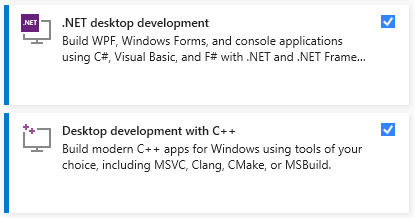
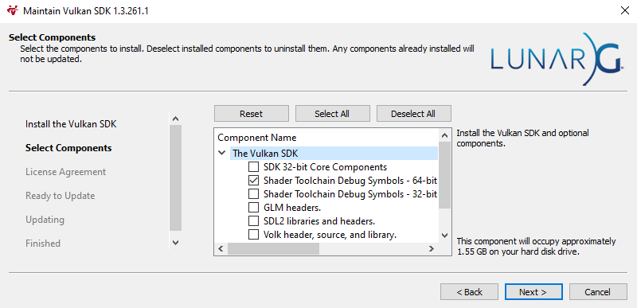

Requirements
============

Firstly, check out the engine's requirements.

- PC
- GPU that supports ``Vulkan 1.2``. `This <https://docs.vulkan.org/guide/latest/checking_for_support.html>`_ guide will help you to determine what Vulkan version is supported by your system
- Visual Studio with ``.NET SDK`` support for writing in-game scripts. Also `C++` support is required if you want to build the engine manually.

.. note::
	The engine most likely won't run on integrated GPUs because usually they lack features and have limitations. But it's worth trying though :)

   Visual Studio requirements

   Vulkan SDK + Debug symbols

If your system meets them, you have two options: you can either build the engine manually or download already built binaries. For further information, follow the :ref:`installation guide <installation_guide>`
