Release notes
=============
New version of `Eagle Engine` is finally here!
It introduces a lot of new exciting features that make it one big step closer to becoming a more or less complete engine.

New version adds support for projects and building them as games (finally).
Rendering now supports `particles`, `animated meshes`, features such as `depth of field`, `motion blur`, `reflections`, and many more.
And last, but not least: Navigation Meshes! Now you're able to make your NPCs have a big brain - they'll able to navigate around the scene and avoid walls & obstacles.

Breathtaking, I know. A wise man once said: "i havig  my new game enjain! coe closer and see. YOU WILL BE IMPRESSED WHAT I AM GOING TO SHOW THE REST OF THE WOLRd!!"
So here it is. Enjoy!

Projects & Assets
-----------------
With this release you're able to create your AAA-projects and work on them separately.
After creating a new project, Visual Studio 2022/2019 solution will be generated for your game-scripts. But you'll need to build it manually by opening up `.sln` file in the projects folder and compiling it.

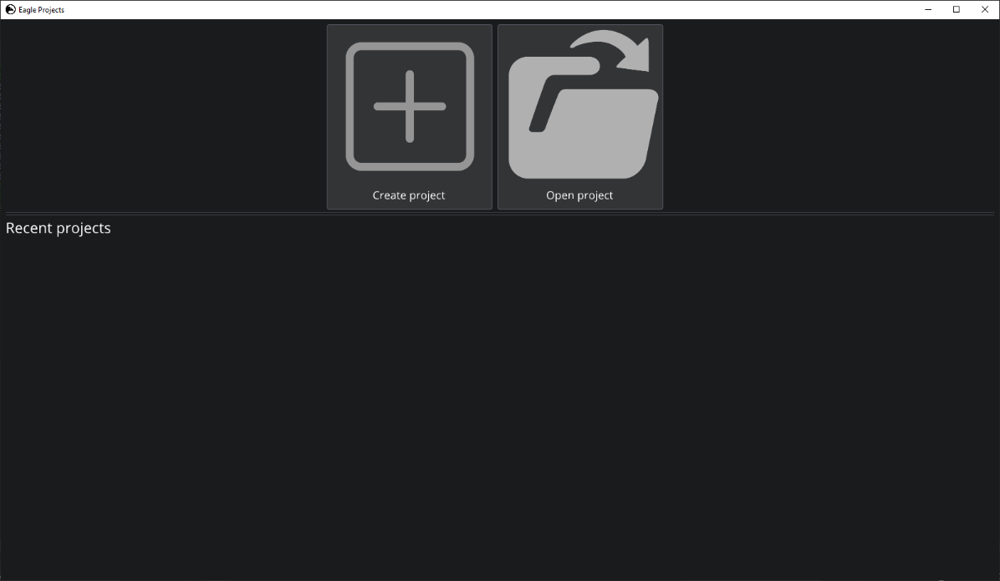

   Projects

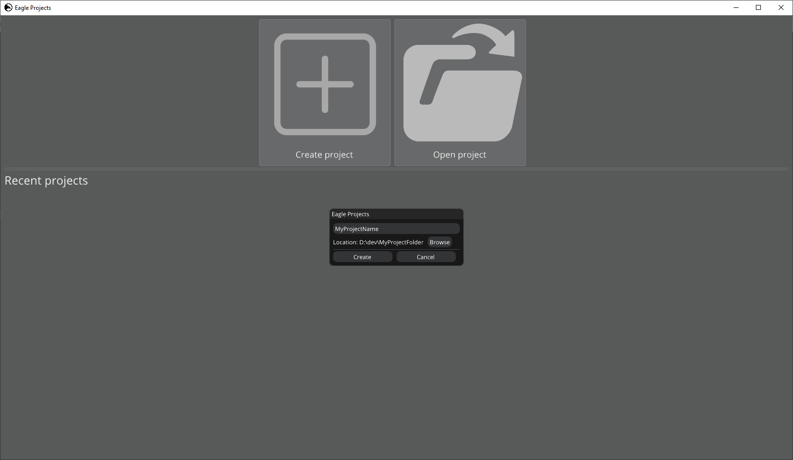

   Project creation

Engine now comes with ``Win-SetupFileAssociation.bat`` script that allows to associate ``.egproj`` files with `Eagle Engine`.
Which means you'll be able to double-click your project file to open it.

Projects don't recognize raw content files anymore (such as ``.png``, ``.fbx``, and etc...)
Instead, they need to be explicitly imported that will convert them into a special `Eagle` asset file format (``.egasset``).

Currently, the engine supports the following asset types:

- :ref:`Texture 2D <asset_texture_2d>`. Supported formats: ``png``; ``jpg``; ``tga``.

- :ref:`Texture Cube <asset_texture_cube>`. Supported format: ``hdr``.

- :ref:`Static <asset_static_mesh>` & :ref:`**Skeletal** <asset_skeletal_mesh>` meshes. Supported mesh formats: ``fbx``; ``gltf``, ``blend``; ``3ds``; ``obj``; ``smd``; ``vta``; ``stl``.

- :ref:`Audio <asset_audio>`. Supported sound formats: ``mp3``; ``wav``; ``ogg``; ``wma``.

- :ref:`Sound Group <asset_sound_group>`. Allows you to group sounds. For example, you can create a "Background music" sound group and assign audio assets to it. Then, you can mute all of them just by muting the sound group.

- :ref:`Font <asset_font>`. Supported font formats: ``ttf``; ``otf``.

- :ref:`Material <asset_material>`.

- :ref:`Physics Material <asset_physics_material>`. Controls static & dynamic friction, and bounciness.

- :ref:`Entity <asset_entity>`. It's is a pretty useful asset type since it allows you to set up an entity that you can easily spawn in the editor or in runtime. You don't have to manually create the same entities anymore.

- :ref:`Scene <asset_scene>`.

- :ref:`Animation <asset_animation>`.

- :ref:`Animation Graph <asset_animation_graph>`.

- :ref:`Particle System <asset_particle_system>`.

.. note::

    A newly created project has two static mesh assets by default: `Cube`, and `Sphere`.

The benefit of having assets is that you can change its settings and affect the whole project.
For example, previously there were no material assets, so if you wanted to create a bunch of same-looking objects, you had to go through all of them and set each material inputs individually. And what if you wanted to adjust something? Again, you'd have go through all of them and change it.
But now you can create a material asset, set it up once, and just assign it to other renderables (meshes, sprites, texts, etc...). When an asset is changed, other object pick up the latest version automatically.

Each asset type has its own editor which can be opened by double-clicking an asset in `Content Browser`. And almost all of these editors have a viewport where you can visualize it.

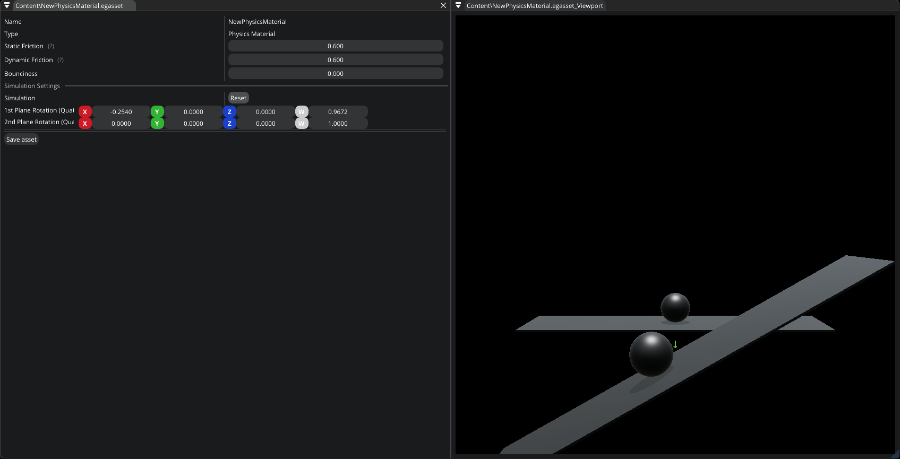

   Physics Material Editor

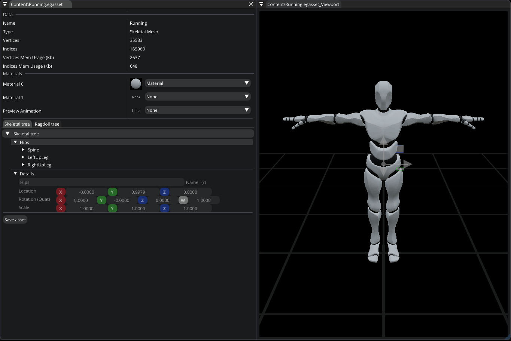

   Skeletal Mesh Editor

.. warning::
    If you ever decide to duplicate an asset manually (bypassing editor's content browser functionality),
    you need to know that it probably won't work correctly since each asset file stores its own unique ID.
    Which means you'll end up with two or more assets that have the same ID.
    So, if you desperately need to do it, you'll have to manually open asset files in a text editor and change its ``GUID`` (two ``uint64`` values).

Game Builds
-----------
Finally, game builds that you'll be able to share with your friends! If you want to build & ship you project as a game, you can just click ``File -> Build project`` and select the destination folder.
But before building it, make sure you've selected a start up scene for the game in ``Project Settings`` tab.

.. figure:: imgs/editor/menubar_file.png
   :align: center

|

Animations
----------
`Eagle` now supports `Skeletal Mesh` component which means you can render animated meshes.

You can open a skeletal mesh asset to visualize it which displays some data about the mesh, materials, skeletal tree, and ragdoll data.

**Skeletal Tree** displays bone transforms in local space (offsets from the origin).
You can't move bones of a mesh, but you can create your own `Virtual` bones by right-clicking a bone in the tree. You can modify their transforms and use them in C# to attach any other game-objects.

   Skeletal Mesh asset editor

**Ragdoll Tree** allows you to setup ragdoll of the mesh. You can change the transformation, mass, linear & angular damping, physics material, and shape of a ragdoll collider (Capsule, Box, or Sphere).
Transforms of ragdoll bones are displayed relative to originally computed transforms. You can also change the way a ragdoll is generated. By increasing ``Min ragdoll bone size``, you can optimize the simulation, since more bones will be merged into a single ragdoll collider.
So, for performance reasons, it's recommended to set it as high as possible. You can also control `Max Twist` and `Max Swing` angles (in degrees).
`Skeletal Mesh Editor` also allows you to simulate the ragdoll you've set up.

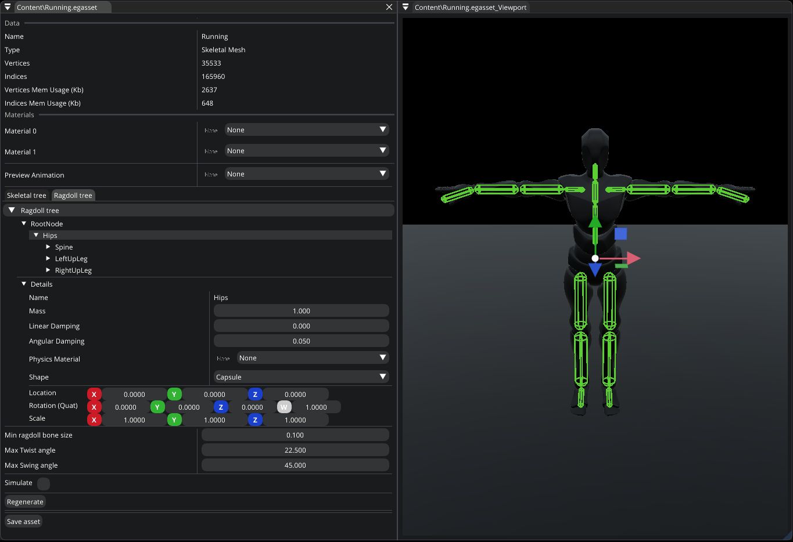

   Skeletal Mesh asset ragdoll editor

|

You can open an animation asset to adjust some of its properties.

- **Extract Root Motion**. Some animations have transformation data embedded into them. In this case, you can enable root motion to let animations drive the entity transformation.
  For example, if root motion is supported and enabled, and you're playing "Run" animation, then the whole Entity will move. So, you can build animation-driven gameplay.

- **Events**. You can create animation events that will allow you to react to them in C#.
  For example, if you want to play "Step" sound, you can create an event at an appropriate timing, and when it's reached, C# ``Entity.OnAnimationEvent()`` is called.

.. figure:: imgs/editor/assets/animation/animation.png
   :align: center

   Animation asset editor

Animation Graphs
----------------
You didn't think `Eagle` wouldn't support any tools to build complex animations, did you?

New version of the engine adds support for `Animation Graphs` which allows to do exactly that.
It's a node based graph editor that drives the animation.
`Animation Graph` supports variables of four types: `Bool`, `Float`, `String`, and `Animation`. All variables can be changed during runtime and accessed in C#.
You can use this asset in ``Skeletal Mesh`` component. Note that each component has its own copy of the graph. So, changing variables in one component won't affect others.

.. figure:: imgs/editor/assets/animationgraph/animationgraph.png
   :align: center

   Animation Graph editor

Animation Graph supports `State Machines` that allow you to define a transition logic for animations.
By clicking on a state itself, you can define an animation that will be played when the state is active.
You can also specify transition settings, such as: `transition condition`, `transition time`, `smooth transition`.
If smooth transition is disabled, frozen transition will be used: clip A is frozen while clip B gradually takes over the movement.
This kind of transitional blend works well when the two clips/poses are unrelated and smooth transition looks unnatural.

To learn more about animation graph and its possibilities, go :ref:`here <asset_animation_graph>`.

.. figure:: imgs/editor/assets/animationgraph/simple_statemachine.png
   :align: center 

   State Machine example

.. note::

    To break a node link/connection, left-click it while holding `Alt`.

GPU Particle System
-------------------
Need particles? Not a problem. The engine now supports emitters that are responsible for spawning and managing a lot particles.
Currently, emitters only support 2D particles, meaning they'll always face the camera.

Go :ref:`here <feature_particles>` to learn more about particles and their settings.

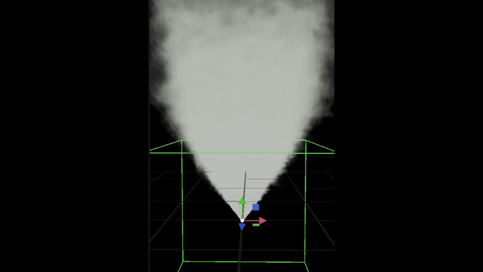

    Simple smoke effect

Screen Space Reflections
------------------------
New version of the engine adds new rendering feature: `Screen Space Reflection (SSR)`.
SSR is a technique for reusing screen space data to calculate reflections.
Since it's a screen space effect, you won't be able to see objects in reflections if they're not on the screen.

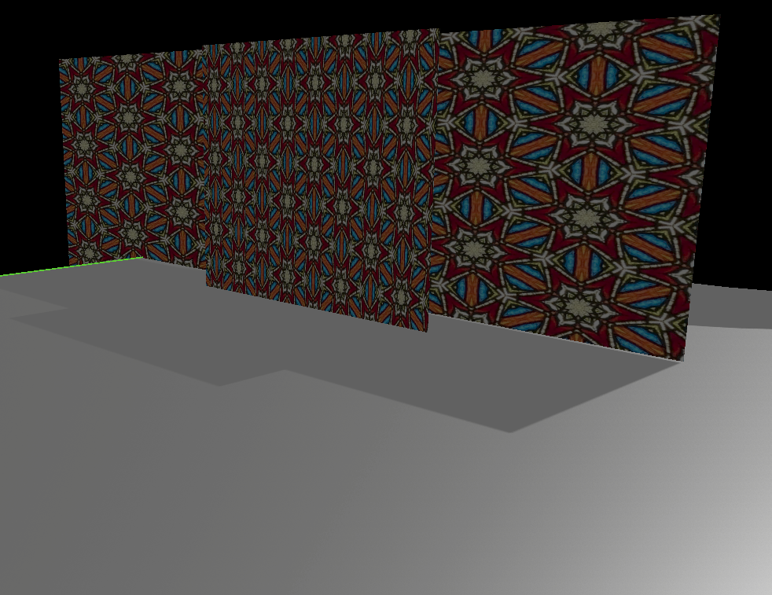

    SSR is disabled

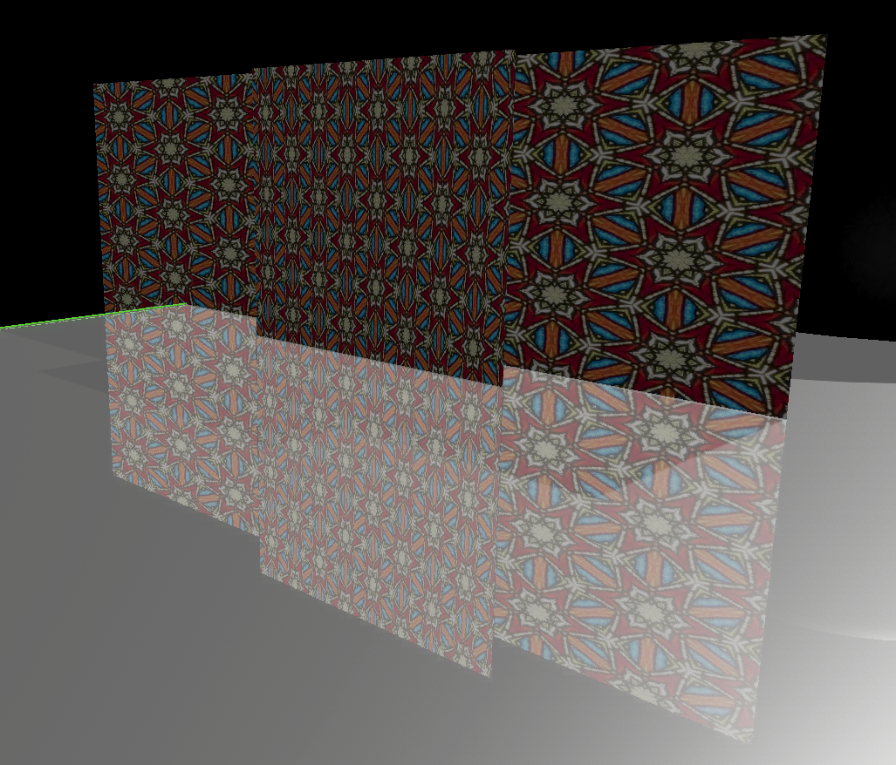

    SSR is enabled

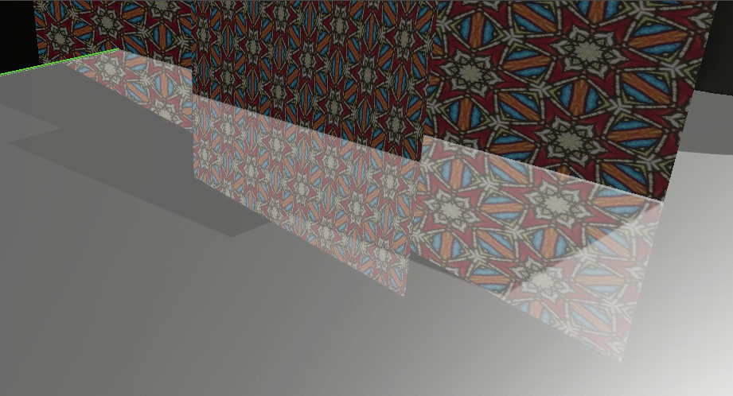

    Reflection is cutoff

You can control the quality of SSR by changing ``Samples per Quad`` and ``Max Traversal Iterations``.
The more, the better, and also slower.

Additionally, you can adjust ``Roughness Threshold`` for SSR. If material's roughness is higher than the threshold, SSR won't be applied.

Depth of Field
--------------
`Eagle` now supports `Depth of Field (DoF)`.
`DoF` is a rendering technique that simulates blur effect similar to how real cameras work.

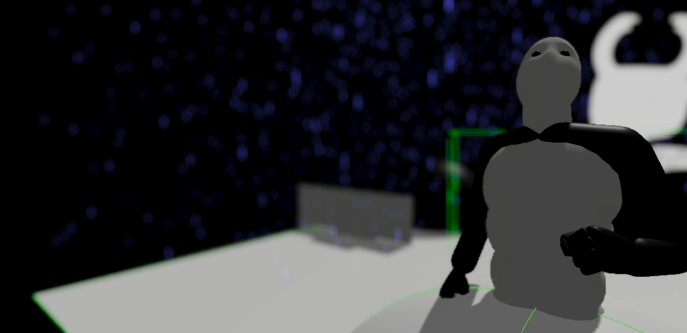

    Depth of Field

You can change aperture shape, size, and focal length to adjust the way blur is applied.
There are also ``COC Scale`` and ``Max COC`` settings for adjusting circle of confusion.

.. note::

	You can set ``Aperture Size`` to `0` to disable DoF.

Motion Blur
-----------
`Eagle` now supports `Motion Blur`. It's a rendering technique that blurs objects that are in motion.

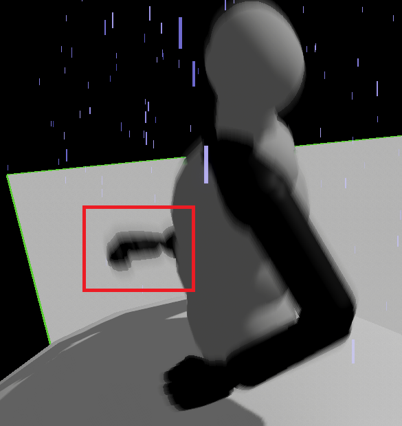

    Motion Blur

You can adjust its quality by changing the ``Samples`` setting.
Also, you can adjust ``Strength`` parameter.

Auto Exposure
-------------
`Eagle` now supports `Auto Exposure`. It simulates how the human eye adjusts to changes in brightness in real-time.
For example, when walking from a dimly lit interior to a brightly lit exterior, or the other way around.

Decals
------
New `Decal` component was added that allows you to project a material on other objects.
Decals support all material features except for the normal.

When using decals, you can set its sort priority: higher values means decal will be drawn on top of others.

If you don't want an object to receive a decal, you can disable it in the corresponding component settings. For example, in `Static Mesh` component.

.. figure:: rendering/imgs/decal.png
    :align: center 

    "Pattern" texture applied as a decal on top of a sphere.

AI Navigation
-------------
Brains! Now `Eagle` supports building navigation meshes which means you'll be able to create NPCs that can move from one point to another and avoid obstacles!

To build a navigation mesh, use :ref:`Navigation Mesh Component <nav_mesh_component>`.

All colliders (expect for mesh collider) can be markes as `Obstacles` that'll affect Nav Mesh.
Obstacles can be spawned & deleted at runtime and navigational mesh will dynamically update itself.

Also all colliders affect nav mesh during the build. If you don't want a collider to affect it during the build, disable ``Affects NavMesh`` in its component.

You can visualize navigation mesh by enabling ``Draw NavMesh`` in ``Editor Preferences`` tab.

.. note::

    ``Is Obstacle`` and ``Affects NavMesh`` are independent from each other.
    Which means you can still use a collider as an obstacle while ``Affects NavMesh`` is disabled.
    Basically, ``Is Obstacle`` is an obstacle that updates Nav Mesh dynamically.
    And ``Affects NavMesh`` is a static obstacle. So, if it changes (moved or deleted), Nav Mesh won't update unless it's rebuilt.

.. note::

    Currently, a scene can only have one active navigation mesh.
    If you need to change Nav Mesh at runtime, then you'll have to do it manually using C# scripts.

The engine also supports a crowd system.
`Navigation Crowd Agent` component allows you mark entities as crowd agents. And the benefit of it is that you can easily control a lot of NPCs and change their move target.
For example, you can create 100 crowd agents, and make all of them to move to a single point by simply calling one C# function: ``CrowdNavigation.SetMoveTarget()``.
Of cource, you can also control each agent individually.
See :ref:`Navigation Crowd Agent Component <nav_crowd_agent_component>` for more details.

.. note::

    You don't have to use crowd agents to move your entities.
    If you want to do it manually, you can call C# functions such as ``Navigation.FindStraightPath()`` to get an array of points you need to move to.

.. figure:: imgs/components/nav_mesh_example.gif
    :align: center 

    Navigation Mesh in action

Editor Updates
--------------
There a few nice editor updates that make your life easier. Mainly, these are `Content Browser` updates.

Since now engine works with assets, content browser allows you to import, save, and reload assets.
What does `reload assets` mean? When importing an assets, its original filepath is saved (e.g. "D:/art/texture.png").
So, if at some point you update this texture and you want to update its asset, you can reload it to update the data.

Content Browser also allows you can copy/cut/paste assets, rename (`F2`), duplicate (`Ctrl + W`), and delete them. Also, now it can delete folders.
As was mentioned before, you content browser allows you to open asset editors by double-clicking them. But also you can open it by clicking an asset thumbnail (for example, in ``StaticMeshComponent`` which display selected asset).

Support for runtime assets thumbnails was added so it's easier to tell what it actually looks like.

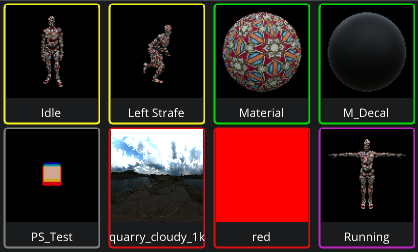

   Asset thumbnails

Editor now exposes more C# types: all asset types (including base ``Asset`` class), and ``Entity`` type.
When ``public Entity`` variable is created in your scripts, the editor allows you to select an entity from the scene to assign to it.

.. note::

    Now UI displays `Quaternions` instead of `Eulers` angles for rotation. Not sure that's a good idea, but it completely fixes Gimbal lock issue.

Other editor changes:

1. Added UI popup messages so that you don't have to look into the console all the time.

2. Editor now shows unsaved assets before closing. You can select whether to save them or discard changes.

3. Increased content browser items from `64x64` to `96x96`.

4. Now Content browser is refreshed if changes are detected.

5. Now `ContentBrowser` displays base mip of textures.

6. Increase UI-precision of transforms (now it displays 4-digits after the point).

7. Changed key-event of "Entity duplication" to `Ctrl+D`.

8. UI improvements: Now components are just unclickable in the `Add Components` list if it already exists.

9. Now windows move only if dragged by title bar.

10. Now `Albedo` buffer visualization works as expect since it no longer stores `Roughness` in its `Alpha`-channel.

11. `Draw Editor Miscellaneous` and `Draw NavMesh` are exposed to `Editor Preferences` window.

12. Added a checkbox to enabled/disable animation updates in the editor.

13. Added `Copy transform from editor camera` button to `Camera Component`'s UI.

14. Input popups now have focus by default & return when `Enter` is pressed.

15. Editor now supports `Sound Groups`.

Other changes
-------------
1. **Materials**. Now materials support raw values, so you don't have to use textures. Also, `Eagle` now supports multiple materials per mesh.

2. Minor perf improvements: now `Conjugate` is used instead of `Inverse` for rotations.

3. Now the size of Prefilter image of IBL can be configured.

4. Lit 3D Texts now use `Material` assets.

5. Added support for .gltf files.

6. Exposed `Scene Gravity` setting.

7. Reversed depth buffer.

8. Improved handling of `Physics Materials`.

9. Meshes, Sprites, and Lit Texts now have `bReceivesDecals` setting.

10. Added `Albedo` and `Anisotropy` as a volumetric fog params.

11. Improved quality of volumetrics.

12. Reduced flickering of Volumetric Lights near the light source by using Karis Average.

13. Added smooth falloff near light edges.

14. Added set/get gravity to C#.

15. Now you can specify `Start` and `End` colors for debug lines.

16. Added `IsValid` to C# entity.

17. Mouse scroll now can be used to change engine provided runtime camera.

18. C#: Added `GetAllEntitiesWithComponent()`.

19. C# wrappers don't return null arrays anymore.

20. Added a way to disable skybox background rendering (Lightting is still applied).

21. Added `QuitGame` to C# (`Scene.QuitGame()`).

22. Added `AABB`, `UVector2`, and `Min/Max` functions to C#.

23. Now C# API supports fonts.

24. Editor & C# now support `Sound Groups`.

25. Moved C# draw function from `Scene` class to `Renderer`.

26. Added support for `mp3` audios.

27. Added support for extracting spectrum data of an audio.

28. Added `Pan` to `AudioComponent`.

29. Now you can select whether `AudioComponent` should use 2D or 3D sound.

Fixes
-----
1. Fixed content browser bug when folder name was cutoff during its creation.

2. Fixed potential crash because of data races in material system.

3. Fixed wrong aspect mask when reading from vulkan image.

4. Fixed logging of path. Now it's converted to utf-8.

5. Fixed users being able to drag simulation panel window.

6. Fixed a crash when changing editor's style.

7. Fixed content browser items not being spaced out uniformly in some cases.

8. Fixed ``CalculateImageMemorySize`` returning incorrect results if `bits < 8`.

9. Fixed events being processed by Editor even if they were processed by content browser.

10. Fixed incorrect gpu layout of index buffer (it was vertex).

11. Fixed incorrectly removing textures from the texture system.

12. Fixed static mesh import not accounting for translation-offset of the mesh.

13. Fixed ImGuizmo incorrectly manipulating relative rotation.

14. Fixed ``operator-`` of ``struct Transform``. Now it divides scales, instead of subtracting.

15. Fixed rare cases of `Help Message` causing crash.

16. Fixed ``UI::Text()`` misalignment of text.

17. Fixed crash in some C# wrappers if Entity is null.

18. Fixed potential memory corruptions.

19. Fixed ``EditorCamera`` always calling ``SetShowMouse(true)``.

20. Fixed ``ShadowPassTask`` incorrectly initializing some shadow maps in some cases.

21. Fixed not initializing ``m_Options_RT`` in `SceneRenderer` constructor.

22. Fixed ``UI::PushItemDisabled`` incorrectly handling multiple `item disabled` pushes.

23. Fixed calculation of `TBN` for meshes.

24. Fixed some issues with camera controls in editor.

25. Fixed resizing ``VertexBuffer`` instead of ``Indexed VB`` during meshes upload.

26. Fixed allocating too much memory on CPU during meshes upload.

27. Fixed not applying ``Tiling Factor`` when reading a normal map of sprites.

28. Fixed `Texture2D` not setting ``m_bIsLoaded`` to `false` while loading.

29. Fixed `TextureCube` not applying format to all image resources.

30. Fixed some image layout formats being ``rgba16f`` instead of ``r11f_g11f_b10f``.

31. Fixed C# ``SetShadowMapsSettings`` not affecting settings.

32. Fixed erros during an import of multiple Texture Cubes.

33. Fixed ``CopyBufferToImage`` and ``CopyImageToBuffer`` bugs.

34. Fixed barriers not working for compute shaders.

35. Fixed ``DrawAssetSelection`` ignoring `Help Message`.

36. Fixed not culling back faces for volume shadows.

37. Fixed `Tint Color` not being applied in some cases.

38. Fixed collisions in ``UI::Combo`` functions.

39. Fixed crash when closing the engine during simulation.

40. Fixed ``Gravity`` not being serialized.

41. Fixed potential crashes in `Physics Actor` when accessing `RigidBodyComponent`.

42. Fixed incorrect GBuffer history copies.

43. Fixed ``UI::InputText()`` not showing a help message.

44. Fixed a bug where physics material wasn't properly initialized in components.

45. Fixed a bug where ``ShowCollision`` and ``IsTrigger`` states were not set correctly when changing mesh collider.

46. Fixed some issues with lights visulization flags.

47. Fixed potential crashes in ``Collider Shape``.

48. Fixed not putting a barrier in ``Image::Read``.

49. Fixed some issues with console messages.

50. Fixed freeing GPU resources too early.

51. Fixed incorrectly shutting down render manager in some cases.

52. Fixed incorrectly leaving fullscreen mode in some cases.

53. Fixed some crashes related to dereferencing dead pointers.

54. Fixed errors when releasing a GPU resource from the main thread.

55. Fixed C# using ``SSAOSettings`` to set ``GTAOSettings``.

56. Fixed ``bAutoPlay`` audios being spawned after scripts.

57. Fixed ``AudioComponent`` not serializing ``Pitch``.

58. Fixed incorrect C# bindings.

59. Fixed engine provided runtime camera potentially blocking other cameras that might be spawned.

60. Fixed deselecting entity when simulation starts.

61. Fixed wrong ``Quat`` layout in C#.

