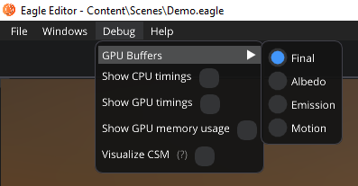
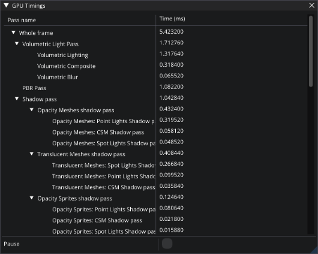
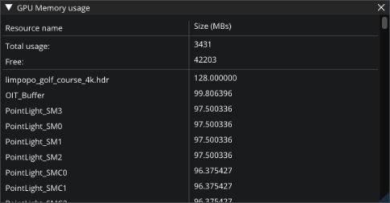
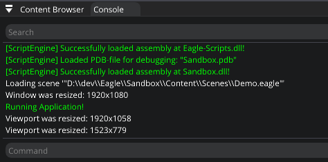
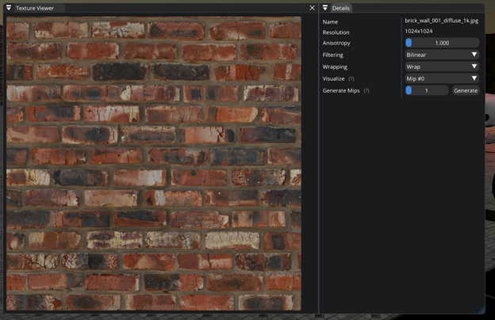

Release notes
=============
It's been almost two years since the last release and the new version is finally here!
You're probably starving to see what's new... and oh boy, there're a lot of changes.

First of all, let's say goodbye to our good old friend `OpenGL` since it was discombobulated (removed) from Eagle Engine. Now the engine uses `Vulkan` as a rendering API.

Rendering system was completely rewritten because the old code was a disaster. You can't even comprehend how much faster the rendering is right now.

Now there're no engine limitations on the amount of point & spot lights you can use in a scene. You want hundreds of them? So be it.
But be aware that there's a limit on how many point & spot lights can cast shadows. The limit is 1024. So, a scene can have 1024 point lights and 1024 spot lights that cast shadows.
The same limit applies to the amount of imported textures and fonts.

**Even faster**. Now, rendering runs in its own dedicated `Render thread` which will make things much faster since other engine systems don't need to wait for the rendering to finish.

PBR
---
The new version introduces support for `physically based rendering <https://en.wikipedia.org/wiki/Physically_based_rendering>`_ (PBR) which makes renders more photo realistic.
`Metalness` and `Roughness` textures were added to materials. `Metalness` controls how 'metal-like' surface looks like. By default, it's 0.
`Roughness` controls how rough surface looks like. `Roughness` of 0 is a mirror reflection and 1 is completely matte. By default, it's 0.5.

Ambient
-------
The old way of working with skyboxes was changed. Now it's required to specify just one cubemap texture (with the .hdr extension) which also lits the scene (Image-based lighting with multiple-scattering).
Additionally, materials have a new `Ambient Occlusion` input which can be used to affect ambient lighting. For example, if material's ambient occlusion is 0, that means the material won't be affected by ambient lighting. 

   Image-based lighting (IBL)

Ambient Occlusion
-----------------
Eagle Engine now also supports SSAO (screen-space ambient occlusion) and GTAO (ground-truth ambient occlusion).
These techniques are used for efficiently approximating the ambient occlusion effect in real time. Note that they do nothing if there's no ambient lighting (for example, IBL). It's also affected by material's `Ambient Occlusion` input.

   Ambient Occlusion

Sky & Clouds
------------
Now you can easily render sky and clouds as you skybox.
Sky doesn't light the scene; it can be used just as a background. It can be used with IBL though. IBL will light the scene, but the background can be rendered as a sky and clouds. 
This feature can noticeably affect the performance especially if a lot of layers of clouds are used. So be careful with it.

   Sky & Clouds with directional light

Soft Shadows
------------
Previous versions of the engine are known for its blocky and awful shadows. It's time to make it better (or worse, depends on what you like).
Now the engine supports soft shadows!

Also, a technique called **Cascaded shadow mapping** is implemented that improves shadows that come from a directional light!
The idea of the technique is to divide the scene in front of the camera into `N` sections and assign each section its own shadow map (4 sections in our implementation, each has its own coverage distance).
That way object close to camera will have better shadows. But what if a shadow lies on two sections? In that case a visible hard transition line will appear.
You can make it not so noticeable by enabling **Shadows smooth transition** feature. Also there's an option to visualize different cascades (sections), and shadow map resolutions can be adjusted to your needs.

Generation of shadows maps of point lights is now much faster. It was achieved by multi-view rendering that allows to draw into different layers of a shadow map at the same time (without issuing a separate draw call for each layer).

All objects & lights now have `Casts shadows` flag; and shadows are now limited by the distance. Shadows are not calculated If an object is too far from the camera.

.. figure:: rendering/imgs/shadows.png
   :align: center

   Hard/Soft shadows

Bloom
-----
It's an effect that makes bright objects to glow. It can be controlled through new material parameters: `Emissive Color` and `Emissive Intensity`.
You can also set a dirt texture for a bloom to use. It can be used to simulate dirty camera lens.

    Without bloom

.. figure:: rendering/imgs/bloom.png
   :align: center

   Bloom

   Bloom with a `Dirt` texture.

Translucent Materials
---------------------
Before, all objects were opaque meaning you couldn't see through them. The new version of the engine introduces support for order independent translucency. It is a technique which doesn't require us to draw our transparent objects in an orderly fashion.
For example, translucent materials can be used for windows. Corresponding material input was added (`Opacity`) which should be in the range from 0 (fully transparent) to 1 (fully opaque).
By default, opacity is 0.5. You can set whether material is translucent or not by changing `Blend mode` parameter of a material.

The engine exposes a setting called **Transparency Layers** which lets you control how good translucent object mix their colors when they're stacked behind each other.
Use this setting with caution because it affects memory usage. Memory consumption in bytes can be calculated by this formula: ``Memory consumption = viewport_width * viewport_height * layers * 12``.

Translucent materials are two-sided meaning the lighting is calculated for both sides.
Also, they receive shadows but, by default, they don't cast one. If you want translucent materials to cast shadows, enable **Translucent Shadows** feature.

On the image below you can see that translucent objects affect lighting. In this example, the light source is white, and the glass is green.
Opacity also affects how much light is passed through. If it's 1, the light will be completely blocked. If it's 0, the light won't get dimmer (it'll be full green).

Be aware that translucent materials do not receive shadows from other translucent materials. And objects that don't cast shadows, might receive incorrect translucent shadows. Note that enabling translucent shadows increases memory usage.

   Translucent material

   Translucent shadows

Masked Materials
----------------
There's more! Now the engine supports masked materials! When in Masked mode, a material is either completely visible or completely invisible.
Masked materials act like opaque ones but with one additional option: you can set a new `Opacity Mask` material input that'll be used to discard certain fragments of an object.
Values below 0.5 are treated as invisible. For example, masked materials can be used for a chain.

.. note::

    Please, don't confuse `Translucent` and `Masked` blend modes. `Masked` pixels are discarded and not renderer at all! They simply don't affect the rendering.
    But `Translucent` pixels are always rendered, lit, and blended with the background allowing you to see through it. `Translucent` blend mode is much more computationally expensive.

.. figure:: rendering/imgs/opacity_mask.png
   :align: center

   Masked material

Volumetric Lights
-----------------
Volumetric light sources allow you to see beams of light by simulating light scattering through the air.
Now all lights can be marked as volumetrics. But in order to use this feature, you'll need to enable it in the `Renderer Settings`.

There's also an option to enable fog for volumetric lights.
If it is enabled, the fog created by lights will be animated.

.. note::

	Volumetric lights can also account for translucent shadows. If translucent shadows are enabled, a volumetric light will increase GPU memory usage.

.. figure:: rendering/imgs/volumetric_light.png
    :align: center 

    Volumetric Lights Off / On

.. figure:: rendering/imgs/volumetric_light_2.png
    :align: center 

    Volumetric Lights Enabled

.. figure:: rendering/imgs/volumetric_light_off.png
    :align: center 

    Volumetric Lights disabled

.. figure:: rendering/imgs/volumetric_light_on.png
    :align: center 

    Volumetric Lights enabled

Text Rendering
--------------
Now Eagle Engine supports font rendering using a technique called `Multi-channel Signed Distance Field` (MSDF).
Using MSDF allows to render text efficiently at almost any size including extremely large text without any pixelization.

You can use new `Text` and `Text2D` components for text rendering. `Text2D` component is not placed on a scene but rather on a screen which can be used for in-game UI.
Text2D will try to be at the same position of the screen no matter the resolution. Also, it'll try to occupy the same amount of space.

You can add font files to a project (.ttf & .otf formats) and set it to be used by text components. Text components have following parameters: Line spacing, Kerning, Max Width.

`Text` component can either cast shadows or not. Also, it has two modes in which it operates: `Lit` or `Unlit` (default).
In `Unlit` mode, there's only one additional `Color` parameter that you can change.
In Lit mode, it reacts to lighting and material parameters can be changed to determine how it should be rendered using full PBR pipeline.

`Text2D` component have following extra parameters: `Color`, `Position`, `Scale`, `Rotation`, `Opacity`, `Is Visible`.
`Position` is a normalized device coordinates. It's the position of the bottom left vertex of the first symbol. (-1; -1) is the bottom left corner of a screen; (0; 0) is the center; (1; 1) is the top right corner.

    Text rendering

Anti-aliasing
-------------
Antialiasing is a technique used in computer graphics to remove the aliasing effect. The aliasing effect is the appearance of jagged edges or `jaggies` in a rasterized image.

Now, Eagle Engine supports `Temporal Anti-aliasing` (TAA).
It is a spatial anti-aliasing technique that combines information from past frames and the current frame to remove jaggies in the current frame.

.. figure:: rendering/imgs/taa.png
    :align: center 

    TAA disabled (on top) / TAA enabled (on bottom).

Fog rendering
-------------
The engine now supports fog rendering which allows you to give depth to a scene by making further objects blend with the fog color.

.. figure:: rendering/imgs/fog_linear.png
    :align: center 

    Linear fog

Tonemapping
-----------
Tonemapping is the process of mapping color values from high dynamic range (HDR) to low dynamic range (LDR).
Eagle Engine now supports 4 tonemapping methods: `ACES`, `Reinhard`, `Filmic`, `Photo Linear`. By default, `ACES` is used.

    ACES

    Reinhard

    Filmic. White point is ``1.0``

.. figure:: rendering/imgs/filmic_5.png
    :align: center 

    Filmic. White point is ``5.0``

.. figure:: rendering/imgs/photo_linear.png
    :align: center 

    Photo Linear. ``S = 0.12``; ``E = 0.1``; ``F = 0.45``. Probably there're better values to use.

Other rendering features
------------------------
1. **Billboards**. Now there's a new `Billboard` Component that allows you to render a texture that always faces the camera. It doesn't affect lighting and doesn't depend on it.
   The editor uses it for lights to show you where they're. You can press `G` to toggle the visibility of Editor-only billboards. Also, Editor-only billboards are not being rendered during a simulation.

2. **Grid**. Now editor scenes have grid that should help with the development. Each cell is a 1x1 m. You can control its scale in `Renderer Settings` tab. Press `G` to toggle its visibility. Also, it's not rendered during a simulation.

3. Added supported for instanced mesh rendering. Now you can render same meshes much more efficiently.

4. Now point/spot lights have radius parameters that can be used to limit them. 

5. You can visualize point/spot lights radiuses by toggling a corresponding flag in their components. As for directional light, you can visualize its direction.

6. Added Renderer Line Width as an option. By changing it, you can tweak debug render lines width. Debug render lines are currently used to visualize point/spot lights radii, and to visualize physics colliders.

7. Reworked SpriteComponent atlas workflow. Now it uses material, but additionally there're some params that allow you to sample a sprite within an atlas.

8. New Image2D component. Same as Text2D but for rendering textures. Note that it's rendered under Text2D.

9. Added two settings for object picking: ``Enable/Disable object picking`` and ``Enable/Disable 2D object picking``.
    You can disable it when it is not needed to improve performance and reduce memory usage. If 2D object picking is disabled, 2D objects will be ignored. This value is ignored, if ``Object Picking`` is disabled.

C# Debugging
------------
Now you can debug C# scripts! The engine comes with ``CSharpDebuggingTool.vsix`` file that can be installed to enable debugging of scripts through C#.

Step to debug:

1. Install ``CSharpDebuggingTool.vsix``.

2. Run Eagle-Editor.

3. Open up projects solution file that contains scripts.

4. In Visual Studio, press ``Debug->Attach Mono Debugger``.

You're good to go. Now you can place breakpoints in your scripts.

C# improvements
---------------
1. Now all components are supported by C#. 

2. Added logging functions: ``Log.Trace()``, ``Log.Info()``, ``Log.Warn()``, ``Log.Error()``, ``Log.Critical()``.

3. Renderer settings are exposed to C#.

4. Added ``Color3`` & ``Color4`` classes which are identical to ``Vector3`` & ``Vector4``. The only difference is how it's displayed in Editor (for colors there'll be a color picker)

5. ``Bool`` type variables are now also exposed from C# to the editor.

6. Now there's no need to type ``Namespace.Class`` for Script Component anymore. It's a drop-down menu where you can choose any existing script.

7. Added ``GetChildrenByName()`` function to C#.

8. Added more `Math` functions.

9. Added default engine textures.

10. Added ``Scene`` class. It allows you to: open a scene; draw lines; raycast for physics interactions.

11. Added ``Project`` class. It allows you to get paths to project folders.

12. Added `Setter/Getter` of `BodyType` of ``RigidBodyComponent``. By default, it's static. So, if you want a dynamic object, you must add RigidBodyComponent first,
    set its body type to dynamic and only after that add any collider component. Since body type is read when a collider component is initialized and cannot be changed later.

13. Added events and ``OnEvent()`` function to C# entity. Currently supported events: WindowClose, WindowResize, KeyPressed, KeyReleased, KeyTyped, MouseButtonPressed, MouseButtonReleased, MouseMoved, MouseScrolled.

14. Added ``IsMouseHovered()`` function to Entity. It can be used to test if an entity is hovered. There's also an overload that takes 2D coords. It checks if an entity would be hovered if a mouse was at the given coordinates.

15. New C# functions: ``Renderer.GetViewportSize()``; ``Input.GetMousePositionInViewport()``; ``Input.SetMousePositionInViewport()``; ``Input.SetMousePosition()``.

16. Unmanaged (faster) execution of C# functions: ``OnCreate()``; ``OnDestroy()``; ``OnUpdate()``; ``OnEvent()``; ``OnPhysicsUpdate()``.

17. Now C# public enum fields are exposed to the editor.

18. Added ``TextureCube`` to C#.

19. Added support for `DopplerEffect` to C#.

20. Added functions to ``Texture`` class of C# that allow you to work with `anisotropy`, `filter mode`, `address mode`, `mips`.

21. Added `VSync` option to C#.

22. Moved physics related functions from ``Entity`` class to ``RigidBodyComponent``.

23. Added ``GetRightVector()`` and ``GetUpVector()`` functions to ``SceneComponent``.

24. Added kinematic related functions to ``RigidBodyComponent``.

25. Renamed ``CreateEntity()`` function to ``SpawnEntity()``.

26. Removed ``TransformComponent``.

27. Changed C# `Sound` API. `Sound` classes are no longer static classes.

28. Now C# ``OnCollisionBegin`` and ``OnCollsionEnd`` receive collision info.

29. Now C# physics callbacks receive parent entity as the first argument.

30. Now script instances are freed when required.

New debug windows
-----------------
Now you can see what your GPU and CPU are doing. New debug windows were added that show you the list of tasks that were just executed and how much it took to execute.

Since the engine uses two threads (main and render), `CPU Timings` tab displays timings per thread. Each of these windows allow you to pause the updates of the timings.
Also, the editor can show your GPU memory usage and what resources take up the memory.

   Debug menu bar

.. figure:: imgs/cpu_timings.png
   :align: center

   CPU timings

   GPU timings

   GPU memory usage

Console
-------
It allows you to see all engine messages and errors.
Currently, it supports just a couple of commands: ``Help`` and ``Clear``. ``Help`` command displays all supported commands and ``Clear`` command clears the console.
Console also supports searches to filter the messages you need.

.. note::

	You can use up/down arrow buttons to go through the history of commands.
	Console also supports command auto-completion by pressing Tab.

   Console

Texture Viewer
--------------
Now it allows you to configure textures settings such as: `anisotropic filtering`; `filtering` (sampling); `wrapping`; `mipmaps`.
Also, `Texture Viewer` now supports cubemaps (textures with `.hdr` extension). But it won't let you configure them as 2D textures.

Go :ref:`here <texture viewer>` to learn more about `Texture Viewer`.

   Texture Viewer

Other editor changes
--------------------
1. Removed `Shaders` Debug-tab.

2. Shader now can be reloaded by F5 (they will reload only if changes were detected).

3. Removed instructions from `Help` window. Now it displays a link to repository and the list of used third party libraries.

4. Performance improvements of `Content Browser` and `Scene Hierarchy`.

5. Improved ``Show in Explorer``. It doesn't cause stalls in the engine anymore.

6. Added more help messages & improved some sliders.

7. Now viewport can be rendered in Full-Screen (F11).

8. Now you can toggle simulation button (`Alt+P`). `ESC` also terminates it.

9. Camera was improved. Now its movement is smooth, and it doesn't flip (hopefully)

10. GPU Buffers visualization only supports: `Albedo`, `Emission`, `SSAO`, `GTAO`, `Motion`. Note that albedo visualization is wrong at the moment because its alpha channel is used for storing ``roughness`` of materials.

11. Now opening another scene is safer in case you wanted to save the current scene. It won't open a new scene if saving has failed.

12. Now there's a pop-up when you want to open a blank scene.

Other changes
-------------
1. Now sprites are two-sided meaning each side will be lit independently.

2. Limited Inner & Outer angles of Spot lights. Improved UI for it.

3. Now serialization stores Enums as Strings (before they were stored as integers).

4. Added ``.tga`` to supported textures.

5. Made ``MeshColliderComponent`` to match ``StaticMeshComponent`` on initialization.

6. Removed ``Open Scene`` button.

7. Improved UI text inputs.

8. Now you can't duplicate an entity in simulation.

9. Removed ``Shininess`` from Material.

10. Now textures are always loaded in Linear Space (non sRGB).

11. Added default `Grey`, `Red`, `Green`, and `Blue` textures.

12. Now when creating an entity through right-clicking on another entity, newly created entity will become its child and copy parent's transform.

13. Reworked `LockFlags` of `RigidBodyComponent`.

14. Exposed `MaxLinearVelocity` and `MaxAngularVelocity` of ``RigidBodyComponent`` to the editor.

15. Now Tint values are HDR.

16. Now kinematic physics actors do trigger callbacks.

17. Now `RigidBodyComponent` inherits `Component` instead of `SceneComponent`.

18. Now all renderer settings affect the whole project.

19. Now you can remove a component by right-clicking it.

20. Removed `SubTexture2D` class.

21. Increased `dynamicTreeRebuildRateHint` that will hopefully lead to improved performance of physics simulations.

22. Increased `MaxSubsteps` of `Physics System` from `8` to `16`. It means that if a frame takes too much time, the physics system might be updated up to `16` times to catch up.

23. Added support for two-sided mesh colliders. It only affects non-convex mesh colliders. Non-convex meshes are one-sided meaning collision won't be registered from the back side. For example, that might be a problem for windows.

24. Updated some 3rd party libraries.

25. Added `Reverb` radius visualization.

26. Changed C++ handling of spawned sounds. Now ``Scene`` class is responsible for it.

27. Now collision contact reports information about it.

Fixes
-----
1. Fixed `Static Mesh` component using wrong material.

2. Fixed `Static Mesh` component not copying Material.

3. Fixed `Audio` & `Reverb` components not updating its location in some cases.

4. Fixed potential memory-leak in Audio Engine.

5. Fixed `Texture Viewer` displaying wrong resolution.

6. Now logger doesn't output to an invisible console in `Dist` builds anymore.

7. Fixed incorrect ``PhysX::Quat`` to ``glm::Quat`` conversion.

8. Fixed `PhysicsActor` setting its own transform (added `bTeleportPhysics` flag).

9. Removed unnecessary reloading of C# assembly.

10. Fixed C# ``GetCollisionMesh()`` & ``SetCollisionMesh()`` functions using ``StaticMeshComponent`` instead of ``MeshColliderComponent``.

11. Fixed C# ``SetDynamicFriction()`` changing `static friction` instead.

12. Fixed memory leak of ``DelayCall()``.

13. Fixed crash if runtime camera is deleted.

14. Fixed passing invalid values to PhysX.

15. Fixed texture cube recreation on scene serialization. Now it checks if it's already loaded.

16. Fixed C# `Static Mesh` component using wrong material.

17. Fixed `InputText` losing focus when `Alt` is pressed.

18. Fixed UI items not losing focus when `Viewport` is right clicked (moving camera).

19. Fixed crash when using unsupported C# public types.

20. Sound selection UI fixes.

21. Fixed notification system hashing ``entt::entity`` which could result in hash collisions between entities of different scenes.

22. Fixed UI `Help Marker` not working if the item is disabled.

23. Fixed C# Quat layout not matching C++.

24. Fixed not finding some C# functions.

25. Fixed a crash when getting entity children from C#.

26. Fixed a bug when parenting entities through UI.

27. Fixed ``bConvex`` of ``MeshColliderComponent`` not being copied.

28. Fixed not clamping some physics values to prevent them becoming negative.

29. Fixed a crash when an imported mesh doesn't have tangents.

30. Now light intensity can't be less than 0.

31. Fixed mouse clicks selecting an entity during a simulation.

32. Fixed incorrectly deserializing static mesh by index.

33. Added a check for ``HasComponent`` in `Script Wrappers` so that engine doesn't crash.

34. Fixed a potential crash if the engine is run on a CPU that doesn't support SSE2.

35. Fixed a bug when renaming one entity could affect another.

36. Fixed a crash when attaching-deleting entities.

37. Fixed not triggering viewport resize functionality for simulation.

38. Fixed C# ``RigidBodyComponent.IsKinematic()`` calling wrong C++ function.

39. Fixed visibility of some C# functions.

40. Fixed a crash when setting/reading a string to/from C# during runtime.

41. Fixed a crash when setting an empty string to C#.

42. Fixed not passing constant timestep to `OnPhysicsUpdate`.

43. Fixed not calling `OnPhysicsUpdate` 120 times per second.

44. Fixed a crash if a browsing folder was deleted.

45. Fixed not being able to create a folder.

46. Fixed some potential crashes when trying to use `Sounds`.

47. Fixed C# sounds not looping.
