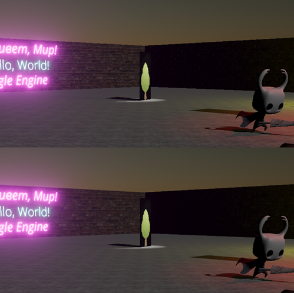

Anti Aliasing
=============
Antialiasing is a technique used in computer graphics to remove the aliasing effect. The aliasing effect is the appearance of jagged edges or `jaggies` in a rasterized image.

Currently, Eagle Engine supports only `Temporal Anti-aliasing` (TAA).

TAA
---
It is a spatial anti-aliasing technique that combines information from past frames and the current frame to remove jaggies in the current frame.

    TAA disabled (on top) / TAA enabled (on bottom).

.. note::

	Currently, it is not production ready.
