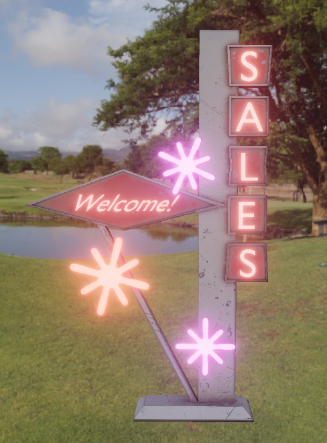

Bloom
=====
Bloom produces a glow around objects that are too bright. It is a real world light phenomena that can greatly add to the perceived realism of a rendered image.

You have the following parameters to control bloom:

1. `Threshold`. Filters out pixels under this level of brightness.

2. `Intensity`. Controls strength of the Bloom.

3. `Dirt Texture`. Can be used to brighten up the bloom in some defined screen areas. This can be used to create a war camera look, more impressive HDR effect, or camera imperfections

4. `Dirt Intensity`.

5. `Knee`. Allows you to make transition between under/over-threshold gradual (0 = hard threshold, 1 = soft threshold).

6. `Enabled`/`Disabled`.

.. figure:: imgs/no_bloom.png
    :align: center 

    Without bloom

    With bloom

.. figure:: imgs/bloom_dirt.png
    :align: center 

    Dirt texture applied

    Example of a bloom dirt mask
