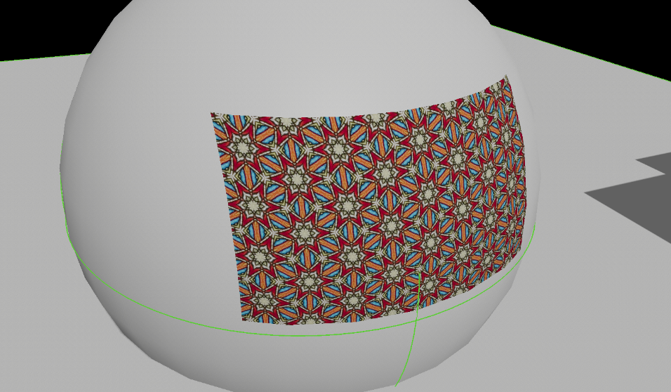

Decals
======
Decals allow you to make modifications to a scene by projecting the material.
Decals support all material features except for the normal.

When using decals, you can set its sort priority: higher values means decal will be drawn on top of others.

If you don't want an object to receive a decal, you can disable it in the corresponding component settings. For example, in `Static Mesh` component.

    "Pattern" texture applied as a decal on top of a sphere.
