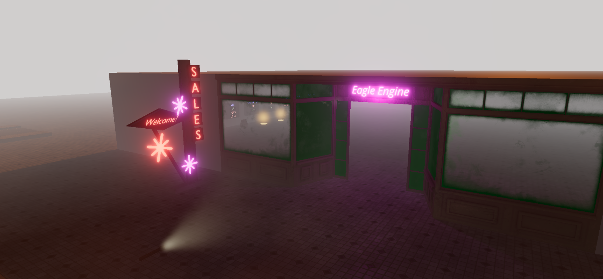

Fog
===
It allows you to give depth to a scene by making further objects blend with the fog color.

Fog settings can be found in `Renderer Settings` and you have the following parameters of control:

1. `Equation`. It can be used to change how the fog blends with the objects (`Linear`, `Exponential`, `Exponential Squared`).

2. `Color`.

3. `Min distance`. Everything closer won't be affected by the fog. Used only by `Linear` equation.

4. `Max distance`. Everything further is a fog. Used only by `Linear` equation.

5. `Density`.  Used by exponential equations.

    Linear fog
