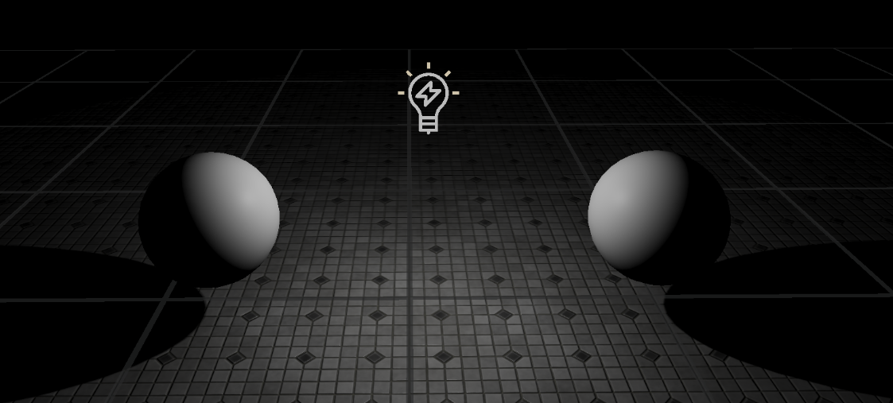
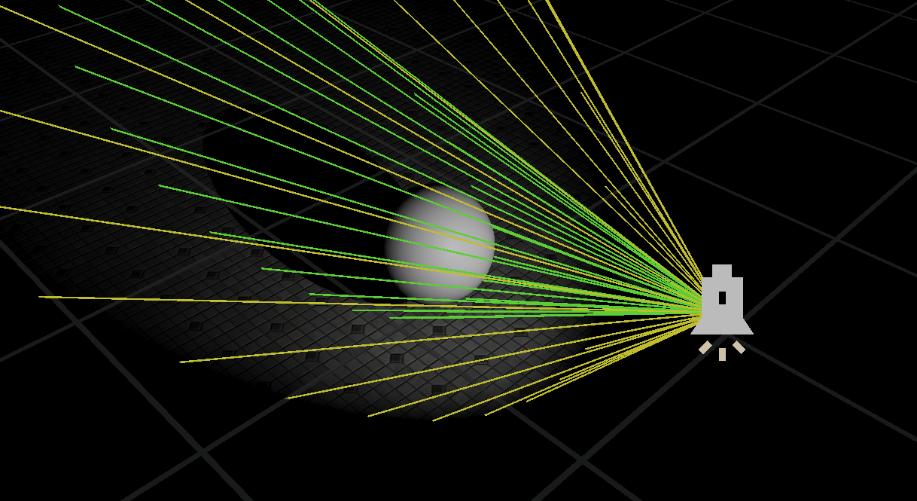
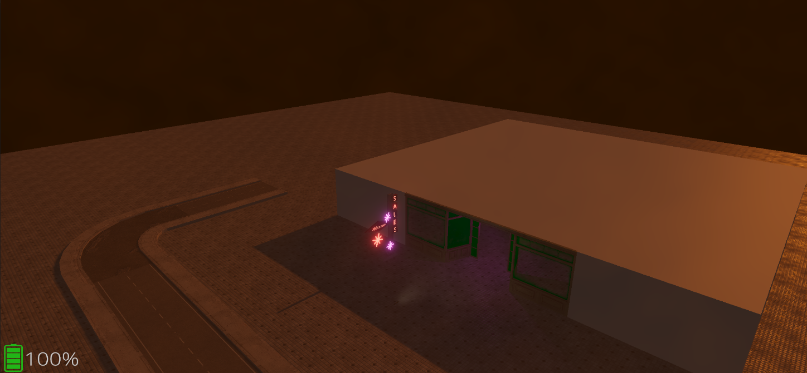

Lights
======

Eagle Engine support three types of analitical light sources: point light; spot light; and directional light.

All these lights share the following parameters:

1. `Light Color`.

2. `Intensity`.

3. `Volumetric Fog Intensity`.

4. `Does Affect World`. If it's set to false, the light will be ignored during the rendering.

5. `Does Cast Shadows`. If it's set to false, the light won't cast shadows.

6. `Is Volumetric Light`.

.. note::

    Currently, the engine supports unlimited amount of light sources. But there's a limit on the amount of light sources that cast shadows. The limit is 1024.
    So, a scene can have 1024 point lights and 1024 spot lights that cast shadows.
    This limit doesn't really apply to `directional` lights since a scene can have only one active `directional` light.

Point Light
-----------
A `point light` simulates a light bulb from the real world which emits light in all directions. But the difference is that analitical light sources emit light from a single point in space.
Point light, additionally, has a ``Radius`` parameter that can be used to limit light's influence.

    Point Light

Spot Light
----------
A `spot light` emits light from a single point in a cone shape. Users are given two cones to shape the light - the ``Inner Cone`` angle and ``Outer Cone`` angle. Basically, Spot Lights work like a flash lights.
Within the Inner Cone angle, the light achieves full brightness. As you go from the extent of the inner radius to the extents of the Outer Cone angle,
a falloff takes place, creating a penumbra, or softening around the Spot Light's disc of illumination.

Also, there's a ``Distance`` parameter that defines the length of the cones.

    Spot Light with cones visualization

Directional Light
-----------------
Directional Light simulates light that is infinitely far away (like a sun). The world position of it doesn't matter, what matters is its direction.

Directional Light has one additional parameter - ``Ambient``. It can be used to light parts of the scene that aren't directly seen by it.

    Directional Light
