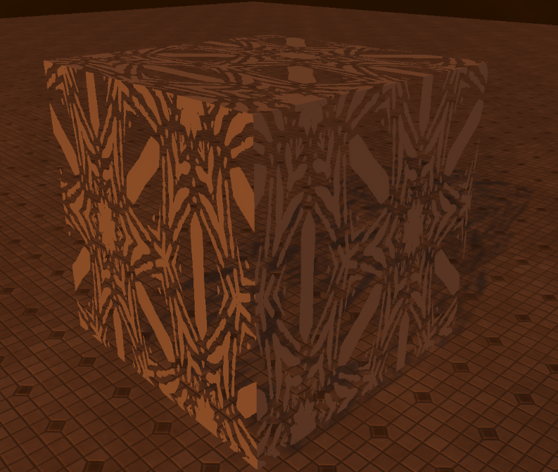
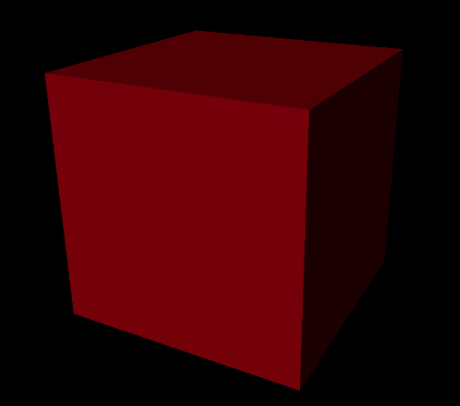

.. _materials:

Materials
=========
A material can be applied to meshes and sprites to define the visual look.
For example, materials allow you to define color, how reflective it is, if it's transparent or not, and many more.

Materials have the following inputs:

1. `Blend Mode`_

2. `Albedo`_

3. `Normal`_

4. `Metalness`_

5. `Roughness`_

6. `Ambient Occlusion`_

7. `Emissive`_

8. `Emissive Intensity`_

9. `Opacity`_

10. `Opacity Mask`_

11. `Tint Color`_

12. `Tiling Factor`_

.. _Blend Mode:

Blend Mode
----------
It controls how your material will blend in with the pixels behind it. Currently, there're 3 types of blend mode:

- `Opaque`. The object is completely opaque and you can't see through it.
- `Translucent`. It allows you to see through objects. It's a value that can vary from 0 to 1. If it's 0, the object is completely transparent; if it's 1, the object is fully opaque.
  Translucency can be controlled using ``Opacity`` input. The default value is ``0.5``.

.. note::

    `Translucent` materials don't cast shadows unless ``Translucent shadows`` features is enabled. Enabling it will increase GPU memory usage.
    Whether this feature is enabled or not, `translucent` materials don't cast shadows on other `translucent` materials.
    Be aware, if non-translucent material doesn't cast shadows, it might receive incorrect translucent shadows.

- `Masked`. When in `Masked` mode, a material is either completely visible or completely invisible.
  `Masked` materials act like opaque ones but with one additional option: you can set an ``Opacity Mask`` input that'll be used to discard certain fragments of the material.
  Values below ``0.5`` are treated as invisible. For example, masked material can be used for a chain.

.. note::

    Please, don't confuse `Translucent` and `Masked` blend modes. `Masked` pixels are discarded and not renderer at all! They simply don't affect the rendering.
    But `Translucent` pixels are always rendered, lit, and blended with the background allowing you to see through it. `Translucent` blend mode is much more computationally expensive.

.. _Albedo:

Albedo
------
It's used to determine the overall color of the material. Currently, only textures can be used as an input for it.

.. _Normal:

Normal
------
Allows you to specify a normal map that is used to improve the look of an object by faking additional details. If it's not provided, baked into mesh normals will be used.
Currently, only textures can be used as an input for it.

    Left crate is rendered without a normal map.

.. _Metalness:

Metalness
---------
It controls how 'metal-like' surface looks. It's a value between 0 and 1, and by default, it's 0. Currently, only textures can be used as an input for it.
  

    The sphere on the left has a metalness of 0. The right one - 1. In both cases, the roughness is 0.5

.. _Roughness:

Roughness
---------
It controls how rough or smooth surface looks. Rough materials scatter reflected light in more directions than smooth materials,
which controls how blurry or sharp a reflection is. Roughness of 0 (smooth) results in a mirror reflection and roughness of 1 (rough) results in a diffuse (or matte) surface.
Currently, only textures can be used as an input for it.
  

    The sphere on the left has a roughness of 0. The right one - 1. In both cases, the metalness is 0.

.. _Ambient Occlusion:

Ambient Occlusion (AO)
----------------------
Can be used to affect how a surface is affected by ambient lighting (IBL or `Ambient` of directional light). For example, if material's AO is 0, that means the material won't be affected by ambient lighting.
By default, it's 1. Currently, can be used as an input for it.

.. _Emissive:

Emissive
--------
It can be used to determine what parts of a surface will glow. By default, it's 0. Currently, can be used as an input for it.

.. _Emissive Intensity:

Emissive Intensity
------------------
It can be used to multiply `Emissive` input by some value. Currently, it's an RGB-float input. (not a texture).

    Usage of `Emissive` and `Emissive Intensity` inputs.

.. _Opacity:

Opacity
-------
Can be used to control translucency of a material. It's only used if `Blend Mode` is set to `Translucent`. It's a value between 0 and 1, where 0 means completely transparent; and 1 represents fully opaque.
By default, it's 0.5. Currently, can be used as an input for it.

.. figure:: imgs/opacity.png
    :align: center 

    Green window with `Opacity` and `Roughness` inputs

.. _Opacity Mask:

Opacity Mask
------------
Can be used to control what parts of a material are either completely visible or completely invisible. It's only used if `Blend Mode` is set to `Masked`. 
Values below ``0.5`` are treated as invisible. By default, everything is visible. Currently, can be used as an input for it.

    Material with `Masked` blend mode and an `Opacity Mask` input

.. _Tint Color:

Tint Color
----------
It's an RGBA-float input that can be used to affect `Albedo` and `Opacity` inputs. ``RGB`` channels affect `Albedo`, and ``A`` channel affects `Opacity`.

    A white material with `Tint Color` set to ``(255, 0, 0, 255)``

.. _Tiling Factor:

Tiling Factor
-------------
It's a float input that can be used to affect UV-tiling.

    `Tiling Factor` of ``1.0`` on the left; and ``2.0`` on the right
