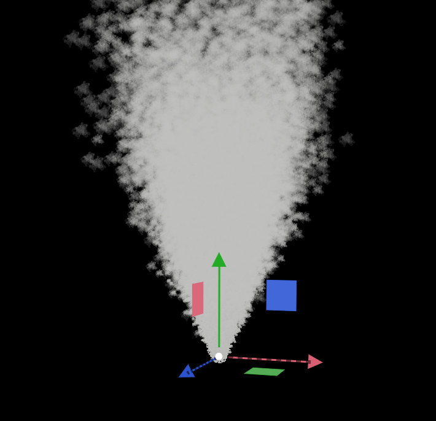
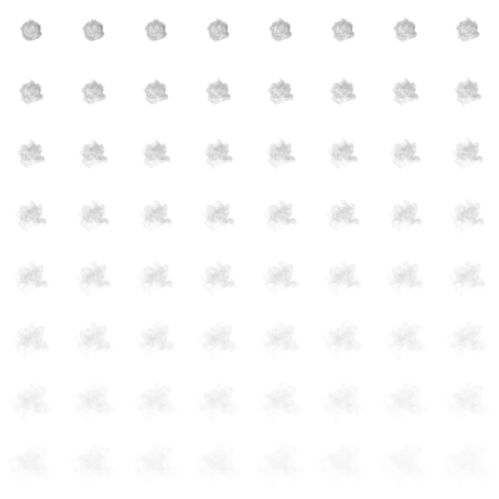

.. _feature_particles:

Particles
=========
Particle system has emitters that are responsible for spawning particles. Each emitter has its own parameters.
Currently, emitters only support 2D particles, meaning they'll always face the camera.

There's a ``Sort opaque particles`` parameter in `Renderer Settings` which you can use to potentially improve performance if you have a lot of opaque particles.
Enabling it will help to avoid overdraws.

    Simple smoke effect

Emitter settings
----------------
- **Relative Transform**. It's relative to the systems world transform.

- **Visibility AABB**. This setting exists purely for performance reasons. If the camera doesn't see the AABB, then emitter won't be renderer, but still updated.

- **Loop Count**. If set to 0, it'll loop infinitely.

- **Particles Amount**. Defines how many particles need to be spawned throughout the life cycle.

- **Particles Amount Ratio**. It's multiplied by the `Particles Amount`. It's purpose is to allow you to change `Particles Amount` and roll back to the original value without having to remember the original value of `Particles Amount`.
  For example, if you want to double the particles amount during the runtime, just set to `2`, and when you want to reset the original amount, set it back to `1`.

- **Texture**. You can set a texture to color particles. If texture compression is enabled, make sure the texture has `Alpha` enabled if you want to use it for alpha-blending.
  Texture can also be to animate particles.

- **Horizontal & Vertical frames number**. Define the number of columns/rows in the texture (sprite sheet).
  Below you can see an example of such texture. During the lifetime, a particle will go through all of them to create an animation.

   Particle texture animation example (8x8)

- **Animation Speed**.

- **Blend Animation**. When enabled, a particle will smoothly transition from one animation state to another.
  For example, instead of immediately switching from animation sprite at (0x0) to (0x1), it'll linearly interpolate between the two.

- **Radial Acceleration**. If it's negative, particles will move towards the center of the emitter. If positive, they'll move away from the center.

- **Tangential Acceleration**. If it's negative, particles will move towards the center of the emitter in a spiral way. If positive, they'll move away from the center.

- **Normal Velocity Factor**. If not 0, particle's initial velocity will be affected by ``EmissionShapeType`` normal direction. Only supported for ``Sphere`` and ``Mesh`` shapes!

- **Collision Mode**. Can be set to ``None``, ``Destroy On Hit``, or ``Bounce``.

.. note::

   It's a screen space collision detection, meaning collision detection won't work if a geometry it's supposed to collide with is not visible.
   Also, precision of the collision detection heavily depends on the camera angle and distance from the geometry.

- **Emission Shape**. Can be set to ``Point``, ``Sphere``, ``Sphere Surface``, ``Box``, ``Ring``, or ``Mesh``.

- **Sphere Radius**. Controls the radius of a sphere that'll be used by ``Emission Shape``.

- **Box Min and Max**. Control the extents of a box that'll be used by ``Emission Shape``.

- **Ring Radius and Thickness**. Controls the ring properties that'll be used by ``Emission Shape``.

- **Mesh**. Allows you to use a static mesh to spawn particles. Used when ``Emission Shape`` is set to ``Mesh``.

- **Destroy Immediately**. If set to true, particles will be disabled/destroyed immediately when emitter is destroyed (instead of following their lifetime).

- **Emit**. If set to false, emitter will stop emitting new particles.

- **Explode**. If set to true, all particles will be emitted at once. Otherwise, they're emitted sequentially throughout the lifetime.

- **Apply Gravity**.

- **Alpha Blending**. Allows you to enable/disable alpha blending.

- **Additive Blending**. Allows you to enable/disable additive blending. When enabled, particle color will be added on top of the existing color (``Backgroud Color + Particle Color``).

Particle settings
-----------------

.. note::

   ``Start/End`` parameters define a value at the beginning and at the end of particles lifetime. So, throughout the lifetime, a particle will transition from `Start` value to `End` value.
   ``Min/Max`` parameters define a range of values. When spawned, particle will use it to generate a random value to use as an initial one.

- **Color Start/End**. Color is multiplied by the texture's color if it's used.

- **Velocity Min/Max**.

- **Velocity Coef Start/End**. They can be used to change the velocity of a particle throughout the lifetime.

- **Rotation Z Start/End**.

- **Size Start/End**.

- **Collider Size Ratio**. It can be used to increase the size of a collider to prevent small and fast-moving particles from clipping through.

- **Lifetime Min/Max**. In seconds.

- **Bounciness Min/Max**.
