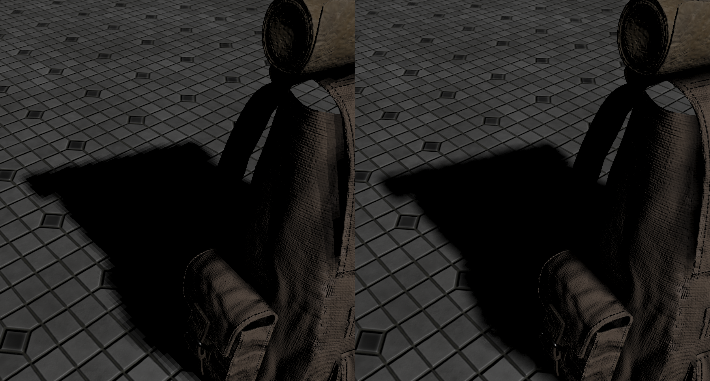

Shadows
=======
Shadows are a result of the absence of light due to occlusion. When a light source's light rays do not hit an object because it gets occluded by some other object,
the object is in shadow. Shadows add a great deal of realism to a lit scene and make it easier for a viewer to observe spatial relationships between objects. They give a greater sense of depth to our scenes and objects.
Shadows are supported by all available light source. Generation of shadow maps for point lights is optimized by using multi-view rendering that allows to draw into different layers at the same time (without issuing a separate draw call for each layer).

Eagle Engine supports `soft shadows` and `Cascaded Shadow Mapping` (CSM).

Soft Shadows
------------
It's a technique that aims to improve the quality of shadows.
Soft shadows are implemented based on a technique described `here <https://developer.nvidia.com/gpugems/gpugems2/part-ii-shading-lighting-and-shadows/chapter-17-efficient-soft-edged-shadows-using>`_.

Soft shadows can be enabled in the `Renderer Settings`.

.. note::

	Hard shadows are still filtered using 3x3 PCF filter.

    Hard and Soft shadows

CSM
---
CSM technique improves shadows that come from a directional light. The idea of the technique is to divide the scene in front of the camera into N sections and assign each section its own shadow map (4 sections in our implementation, each has its own coverage distance).
That way object close to camera will have better shadows.

But what if a shadow lies in two sections? In that case a visible hard transition line might appear because of lower resolution of a section.
You can make it not so noticeable by enabling ``Shadows smooth transition`` in `Renderer Settings`. There're also two more parameters that allow you to control CSM:

1. `Cascades Split Alpha`. It's used to determine how to split cascades for directional light shadows. 

2. `Cascades Smooth Transition Alpha`. The blend amount between cascades of directional light shadows. Try to keep it as low as possible.

Notes
-----
- There's an option to visualize different cascades (sections). You'll need to click on ``Debug`` menu tab and enable ``Visualize CSM`` option.

- Shadow map resolutions can be changed in ``Renderer Settings`` tab.

- All objects & lights have ``Casts shadows`` flag. When disabled, they won't casts shadows, and it also results in improved performance.

- Shadows are limited by the distance. If an object is too far from the camera, it won`t cast shadows. See ``Shadow Settings`` in ``Renderer Settings`` tab.
  Some of the shadow settings only apply to an editor camera. For gameplay, see Camera Component`s shadow settings.
