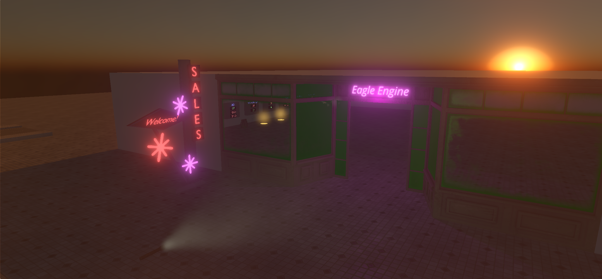

Tonemapping
===========
Tonemapping is the process of mapping color values from high dynamic range (HDR) to low dynamic range (LDR).

Eagle Engine currently supports 4 tonemapping methods: `ACES`, `Reinhard`, `Filmic`, `Photo Linear`. By default, `ACES` is used.

ACES
----
It is a close approximation of the reference ACES tonemapper which is used for a more cinematic look.

.. figure:: imgs/aces.png
    :align: center 

    ACES

Reinhard
--------
This is one of the simplest and most common tonemapping method. It's calculated as ``Output = Color / (Color + 1)``.

Usually, Reinhard looks more grey-ish and the whites are less blown out, when compared to other methods.

.. figure:: imgs/reinhard.png
    :align: center 

    Reinhard

Filmic
------
The problem with the 'simple' Reinhard is that it doesn't necessarily make good use of the full Low Dynamic Range.
If our max scene radiance happened to be (1.0, 1.0, 1.0) then the resulting maximum brightness would only be (0.5,0.5,0.5) - only half of the available range.

`Filmic` tonemapping method is basically an extented version of a simple `Reinhard`. It aims to fix its issues by allowing you to set a ``White Point`` parameter
that represents the biggest radiance value in the scene.

.. figure:: imgs/filmic_1.png
    :align: center 

    Filmic. White point is ``1.0``

    Filmic. White point is ``5.0``

Photo Linear
------------
It aims to simulate a real world camera.

You have three parameters of control:

1. `Sensitivity`. It is the luminance of the scene in candela per m^2

2. `Exposure Time`. It is the exposure time in seconds.

3. `F-Stop`. It is the aperture f-number (focal length of the lens).

    Photo Linear. ``S = 0.12``; ``E = 0.1``; ``F = 0.45``. Probably there're better values to use.
