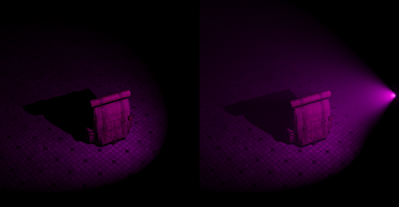
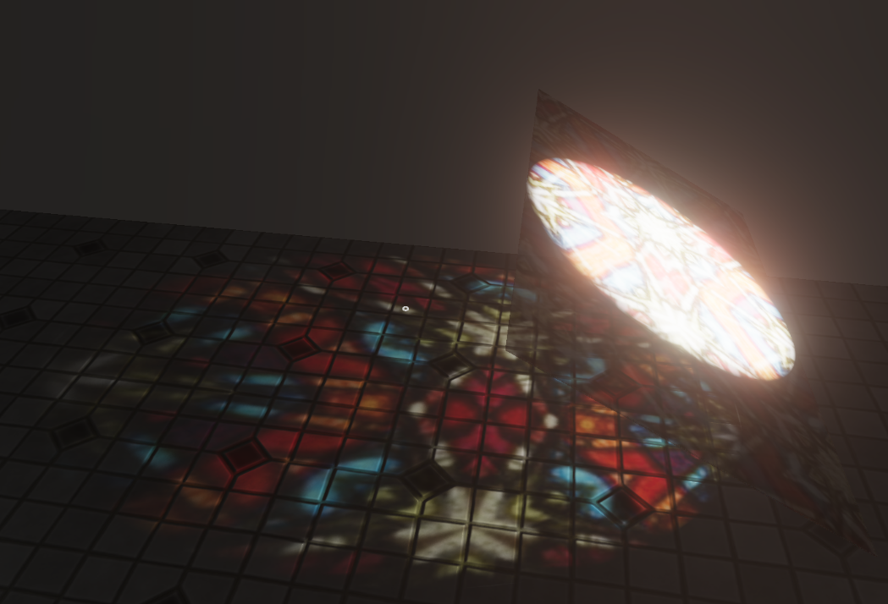
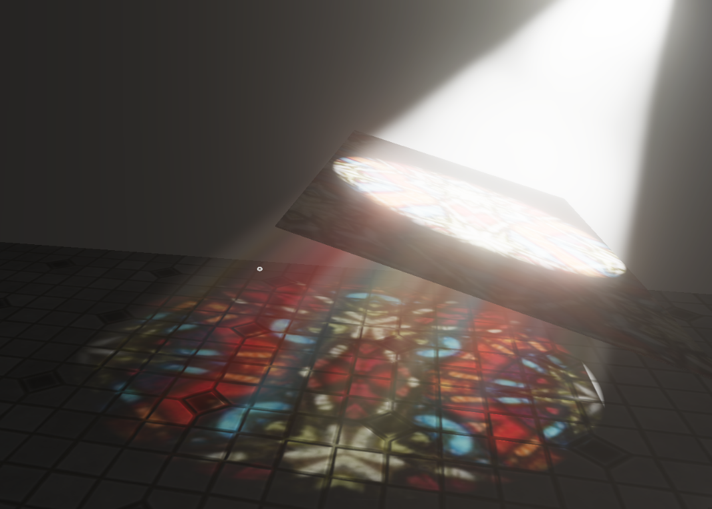

Volumetric Lights
=================
Volumetric light sources allow you to see beams of light by simulating light scattering through the air.
All lights can be marked as volumetrics. But in order to use this feature, you'll need to enable it in the `Renderer Settings`.

In the `rendering settings` of volumetric light, you'll see ``Samples`` parameter that lets you control its visual fidelity. Making it too high will affect the performance.
There's also a ``Max Scattering Distance`` parameter that allows you to set a distance from camera beyond which volumetric light effects won't be calculated. 

.. note::

	Volumetric lights can also account for translucent shadows. If translucent shadows are enabled, a volumetric light will increase GPU memory usage.

Volumetric Fog
--------------
In the `renderer settings`, there's also an option to enable fog for volumetric lights.
If it is enabled, the fog created by lights will be animated. You can control the animation speed by using ``Speed`` parameter.

    Volumetric Lights Off / On

.. figure:: imgs/volumetric_light_2.png
    :align: center 

    Volumetric Lights Enabled

    Volumetric Lights disabled

    Volumetric Lights enabled
